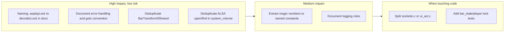

# Step 9: Summary and suggested priority

**Suggested order of work:**

1. **Quick wins:** Align naming (aoplayLock → decoderLock in docs/comments/macros) and standardize goto label in `system_volume.c` to `cleanup`.
2. **Documentation:** Add a short error-handling and logging convention (sections 2 and 3).
3. **Deduplication:** BarTransformIfShared unification and ALSA helper (section 5).
4. **Constants:** Extract a few key magic numbers (section 4).
5. **As needed:** File splits (section 6) and extra tests (section 8) when modifying those areas.

This keeps the codebase consistent and easier to maintain without a large refactor.
