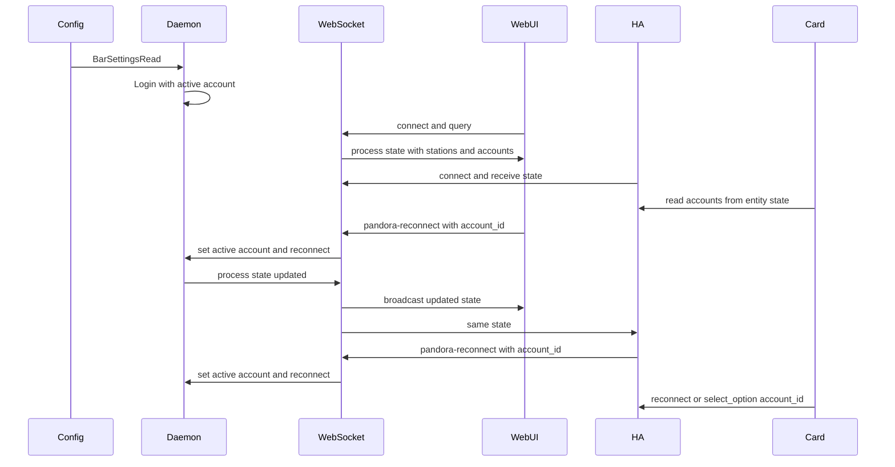

# Pandora multi-account credential switching

## Scope

- **remote-pianobar**: Config format for multiple accounts, runtime account list + active index, reconnect with optional account selection, and WebSocket state for UIs.
- **Web UI**: Account dropdown; send `app.pandora-reconnect` with chosen account when switching.
- **remote-pianobar-ha**: New Select entity for "Account to use"; **reconnect service must** accept optional `account_id` and pass it through to `app.pandora-reconnect`.
- **remote_pianobar_card** (Lovelace media player card): **Advanced** section shows Pandora account selection **only when** there is more than one account (same account list as the integration).

Single-process model: one daemon, one active Pandora session at a time; switching account = disconnect (if needed) then reconnect with the selected account's credentials.

---

## Config file format (include-file per account)

Current config is key-value in [settings.c](remote-pianobar/src/settings.c) (`key = value`). Two modes:

**One account:** Credentials go in the main config. No `account` lines. `user` and `password` (or `password_command`) live in the main config file. Behaves as today (single account, index 0).

**Multiple accounts (main + include files):** The main config may contain **global settings and credentials for the primary user**. Additional accounts are listed with `account = id:path`. The primary user (credentials in the main file) is one logical account in the list:

- **Primary account id:** Optional `main_account_id = <id>` in the main config names that account’s stable id for reconnect/UI. If omitted, the id is **`default`**. (Example: `main_account_id = home` so the main user appears as `home` in dropdowns; otherwise they appear as `default`.)
- **Additional accounts:** Each `account = id:path` adds another account; credentials and optional per-account options for that row come from that file. Effective config for those accounts = merge(main config, account file); main supplies defaults, account file overrides credentials and any listed keys.
- **Ordering:** Build the account list as: first entry = main-config credentials (id from `main_account_id` or `default`), then each `account = id:path` in file order. No warning when both main credentials and `account` lines exist—they are intentional.
- **Startup account:** If `default_account` is set, it must match an account id (including `default` or whatever `main_account_id` is); use that index at startup. If unset, use index 0 (the main-config account when present, else the first `account = id:path` row).
- **File-only multi-account (optional):** If there are `account = id:path` lines but **no** main-config `user`/`password`/`password_command`, treat every account as file-backed (no synthetic `default` row); first listed file is index 0. This keeps a credentials-in-files-only layout valid without a dummy main user.

- **Path resolution** for `account = id:path`: If `path` starts with `~` or `/`, use it as-is (after tilde expansion). Otherwise resolve relative to the main config file's directory. Examples: `work:work.conf`, `personal:~/.config/pianobar/accounts/personal.conf`, `other:/usr/home/fred/.config/pianobar/fred.conf`.
- **Account display name**: Optional `account_label` in each account's file. If not specified, use the id from the `account = id:path` line (e.g. `other`).

**Single-account example** (main config only):

```ini
user = me@example.com
password = secret
sort = name_az
websocket_port = 9001
```

**Multi-account example** (main config: primary user + extra accounts):

```ini
# Primary Pandora user (id "default" unless main_account_id is set)
user = me@example.com
password = secret
# main_account_id = home   # optional; if set, primary user’s id is "home" instead of "default"

sort = name_az
websocket_port = 9001
# default_account = work   # optional startup id; must match main_account_id, "default", or an account = id

account = work:work.conf
account = personal:~/.config/pianobar/accounts/personal.conf
account = other:/usr/home/fred/.config/pianobar/fred.conf
```

Example account file `work.conf` (credentials + optional overrides):

```ini
user = work@example.com
password = workpass
account_label = Work
autostart_station = 98765
```

(If `account_label` is omitted, display name is the id from the account line, e.g. `work`.)

---

## Backend (remote-pianobar) implementation

### 1. Data structures

- **Account entry**: `typedef struct { char *id; char *label; char *username; char *password; char *passwordCmd; } BarAccount_t;` (id from config, e.g. "work"; label = `account_label` from that account's file if present, else id).
- **Settings**: In [settings.h](remote-pianobar/src/settings.h), add to `BarSettings_t`:  
`BarAccount_t *accounts; size_t accountCount; size_t activeAccountIndex;` (optional `char *mainAccountId` or store id on first `BarAccount_t`).  
Single-account mode: no `account` lines; main config has user/password; one account (index 0). Multi-account mode: first account from main-config credentials with id = `main_account_id` if set, else `default`; subsequent accounts from `account = id:path` with merge(main, file). Keep existing `username`/`password` for backward compatibility and as the source for the primary account row.
- **Helpers**: `BarSettingsGetActiveAccount()`, `BarSettingsSetActiveAccount(index or id)`; resolve `password_command` per account when building login credentials (reuse existing passwordCmd logic).

### 2. Config parsing

- In [settings.c](remote-pianobar/src/settings.c) `BarSettingsRead`:
  - **Single-account**: If no `account = id:path` lines, read main config as today; build one account (index 0) from main config. Label = `account_label` if present in main config, else a default (e.g. id `"0"` or `"main"`).
  - **Multi-account**: If any `account = id:path` line exists: **(A)** If main has `user`/`password`/`password_command`, prepend account 0 from main; id = `main_account_id` if set, else **`default`**; then for each `account = id:path`, merge main → file and append. **(B)** If main has no credentials, only file-backed accounts (first `account` line = index 0). Parse optional `default_account = id`; if set, resolve to index (error if id missing); else activeAccountIndex = 0. Labels from `account_label` or id. **Do not** ignore main credentials when present alongside `account` lines; no startup warning for that case.
  - **Merge helper**: Add `BarSettingsMergeFromFile(BarSettings_t *base, const char *path)`: read the file at `path`; for each key present, override the corresponding field in `base`. For file-backed accounts, effective config = merge(main snapshot, account file). The primary row uses main config fields only (no merge file). For single-account, no merge.
  - In `BarSettingsDestroy`, free each account's strings and the array (including account file paths).

### 3. Login and reconnect

- **Startup**: In [main.c](remote-pianobar/src/main.c) `BarMainLoginUser`, use credentials from `BarSettingsGetActiveAccount(app->settings)` (or fallback to `app->settings.username`/`password` if no accounts).
- **Reconnect**: In [ui_act.c](remote-pianobar/src/ui_act.c) `BarUiActPandoraReconnect`:
  - If WebSocket calls with payload, add a new path: parse `account_id` or `account` (index/label) from `data` (need to pass `json_object *data` from socketio into the callback or have a small helper that sets active account from JSON then calls existing reconnect logic). So either:
    - Extend the action dispatcher so that for `BAR_KS_PANDORA_RECONNECT` it can pass `data` into a new `BarUiActPandoraReconnectWithPayload(app, data)` that reads `account_id`/`account`, sets active account, then runs the same login + get-stations + resume flow; or
    - In `BarSocketIoHandleAction`, when action is `app.pandora-reconnect` and `data` is present, extract account, set `app->settings.activeAccountIndex`, then call the same `BarUiActPandoraReconnect` (which uses active account). Ensure thread safety (Piano/login is done on main loop).
  - If currently logged in and the selected account differs from the one that was used for the current session, perform disconnect (stop, clear stations, PianoDestroy) then reconnect with the new account's credentials.
- **Credentials for login**: When building `PianoRequestDataLogin_t`, use the active account's username/password (or run password_command for that account). Reuse existing password_command pattern from [main.c](remote-pianobar/src/main.c) if needed at runtime for an account.

### 4. WebSocket API

- **Reconnect with account**: In [socketio.c](remote-pianobar/src/websocket/protocol/socketio.c), when handling `action` `app.pandora-reconnect` with object `data`, read `account_id` or `account` (string: index or label). Set active account; then call disconnect (if connected) + existing reconnect flow. Document in [WEBSOCKET_API.md](remote-pianobar/WEBSOCKET_API.md): e.g. `2["action",{"action":"app.pandora-reconnect","account_id":"1"}]`.
- **State**: In `BarSocketIoEmitProcess` ([socketio.c](remote-pianobar/src/websocket/protocol/socketio.c) ~568), add to the emitted JSON:
  - `current_account`: object `{ "id": "0", "label": "Work" }` (id = stable id, label = display name).
  - `accounts`: array of `{ "id": "0", "label": "Work" }` (no passwords). So clients get the list and the active one for a dropdown.

Emit the same state after reconnect or account switch (already done via existing `BarSocketIoEmitProcess` / broadcast after reconnect).

---

## Web UI (remote-pianobar webui)

- **State**: In [webui/src/app.ts](remote-pianobar/webui/src/app.ts), from the `process` (or equivalent) payload, store `current_account` and `accounts` in component state.
- **UI**: Add an account selector (e.g. in the top bar or info menu): dropdown or list bound to `accounts`; selected = `current_account`. Only show when `accounts.length > 1`.
- **On change**: Send `2["action",{"action":"app.pandora-reconnect","account_id":"<selected id>"}]` (use existing SocketService). Optionally show a short "Switching account…" state and handle errors from `app.pandora-reconnect` (e.g. error event).
- **Reconnect button**: Keep as "reconnect with current account"; no change unless you want an optional "Reconnect as…" that opens a small modal to pick account then reconnect with that `account_id`.

---

## Home Assistant (remote-pianobar-ha)

- **Coordinator**: In [coordinator.py](remote-pianobar-ha/custom_components/pianobar/coordinator.py), when processing the WebSocket state that includes `process` (or the event that carries the same payload), update `coordinator.data` with `current_account` and `accounts` (list of `{ "id", "label" }`). Ensure this is the same structure the backend sends. **Expose `accounts` and current account id/label on the media player entity attributes** (when useful) so the Lovelace card can read them without hard-coding the account Select entity id; alternatively the card may resolve the account select entity from the config entry.
- **Select entity**: Add a second Select in [select.py](remote-pianobar-ha/custom_components/pianobar/select.py) (existing one remains the station selector):
  - Entity: e.g. "Pandora account" or "Account to use"; `options` = list of account labels (or ids); `current_option` = label (or id) of `current_account`.
  - `async_select_option`: map selected label back to account id, then call `await self.coordinator.send_action_with_params("app.pandora-reconnect", {"account_id": id})`. Coordinator already has [send_action_with_params](remote-pianobar-ha/custom_components/pianobar/coordinator.py) that sends `{"action": action, ...params}`.
- **Reconnect service** (required): Extend the `reconnect` service in [__init__.py](remote-pianobar-ha/custom_components/pianobar/__init__.py) and [services.yaml](remote-pianobar-ha/custom_components/pianobar/services.yaml) to accept an optional `account_id`. When `account_id` is provided, call `send_action_with_params("app.pandora-reconnect", {"account_id": account_id})`; when omitted, call reconnect without `account_id` (current account). Document the new field in `services.yaml`.
- **Device/entity naming**: Place the new Select on the same device as the existing station Select; unique_id e.g. `{entry_id}_account_select`.

---

## Lovelace card (remote_pianobar_card)

- **Placement**: Add account selection inside the card’s **Advanced** section—the same surface used for power-user / secondary actions (e.g. overflow menu block titled **Advanced**, or equivalent subsection in [pianobar-media-player-card.ts](remote_pianobar_card/src/pianobar-media-player-card.ts) / [overflow-menu.ts](remote_pianobar_card/src/components/overflow-menu.ts)). Do **not** put it on the card editor’s “Advanced” config tab unless that tab is explicitly repurposed; prefer **runtime** UI.
- **Visibility**: Render the account control **only when** `accounts.length > 1` (from media player `attributes` or coordinator-fed state). Hide entirely for single-account setups.
- **Behavior**: Dropdown (or `ha-select`-style) listing account labels; selected value = current account. On change: call `pianobar.reconnect` with `account_id`, or `select.select_option` on the integration’s account Select entity—whichever matches existing card patterns for station/actions.
- **Loading / errors**: Brief “Switching account…” or disable control while reconnect is in flight; surface service errors if reconnect fails.

---

## Data flow (high level)



---

## Cross-client synchronization

Multiple clients (web UI tabs, HA coordinator, Lovelace card) connect simultaneously via WebSocket. When any client triggers an account switch or station change, all other clients must reflect the updated state without manual refresh.

### Mechanism

The backend's `BarSocketIoEmit` function broadcasts every event to **all** connected WebSocket clients. After an account switch, the backend emits both `stations` (new account's station list) and `process` (full state including `current_account` and `accounts`) to all clients. This is the primary sync mechanism—no polling or per-client state is needed.

### Per-layer requirements

- **Backend**: All account switch code paths must emit both `stations` and `process` events after completion. The direct-call path in `socketio.c` (account switch with `account_id`) calls `BarUiActPandoraReconnect` (which broadcasts `stations` inside) and then `BarSocketIoEmitProcess` (which broadcasts `process` with updated `current_account`). The keyboard 'R' path goes through the dispatch table and the main loop handles state emission. No unicast—always broadcast.
- **Web UI**: The `process` event handler in `app.ts` updates `currentAccountId` and `accounts` from server state, overriding any optimistic local state. The `stations` event handler replaces the entire station list. Multiple browser tabs each have independent WebSocket connections and all receive broadcasts. When another client switches accounts, the local UI updates reactively without user interaction.
- **HA coordinator**: `_handle_process_event` updates `data["accounts"]` and `data["current_account"]`; `_handle_stations_event` replaces `data["stations"]`. After each event, `async_set_updated_data(self.data)` fires, which triggers all `CoordinatorEntity` subclasses (station select, account select, media player) to re-render with current state. No additional work needed—HA's coordinator pattern handles propagation.
- **HA Account Select**: `options` and `current_option` are computed properties reading from `coordinator.data`. When the coordinator's data changes (via broadcast from backend), the entity's state automatically updates in HA, which propagates to dashboards and automations.
- **HA Station Select**: Same pattern—`options` reads from `coordinator.data["stations"]` and `current_option` from `coordinator.data["station"]`. After an account switch, the old station name won't match the new list, so `current_option` returns `None` until the new account's station starts playing.
- **Lovelace card**: Reads from HA entity state via `this.hass.states[entityId]`. HA calls the card's `set hass()` whenever any watched entity changes. The card must **not** cache account or station data locally—always derive from `hass.states` so that external changes are reflected immediately. The account selector in the overflow menu should read from the Account Select entity's `options` and `state` attributes.

### Edge cases

- **Optimistic state vs. server correction**: The web UI sets `currentAccountId` optimistically when the user clicks "Switch". If the backend fails (bad credentials, network error), the subsequent `error` event arrives and the next `process` event (from a successful reconnect by another client, or on browser refresh) will correct the stale optimistic value.
- **Modal showing during external switch**: If the switch-account modal is open in one tab and another tab switches accounts, the `currentAccountId` prop updates from the `process` event. The modal's "Switch" button disables when `selectedAccountId === currentAccountId`, so if the desired account was already switched to externally, the button correctly becomes disabled.
- **Station list flash**: Between the account switch and the `stations` broadcast arriving, a brief moment may show stale stations. This is acceptable—the `stations` event arrives within the same reconnect sequence (typically < 1 second).

---

## Testing and docs

- **Backend**: Unit or manual: single-account; multi-account with main user + `account = id:path`; optional `main_account_id`; `default_account` startup; switch via WebSocket `account_id` (including `default`); verify merge for file-backed accounts only.
- **Web UI**: Manual: two accounts, switch via modal; confirm stations and playback reflect the selected account.
- **HA**: Manual: select entity shows accounts; reconnect service with/without `account_id`; changing select triggers reconnect and media player reflects new account.
- **Card**: Manual: with 2+ accounts, overflow menu shows account picker; single account hides it; switch account and confirm media player / stations update.
- **Cross-client sync**: Open web UI in two browser tabs and HA dashboard simultaneously. Switch account from one tab; verify the other tab's station list and account indicator update without refresh. Switch from HA; verify web UI updates. Switch from web UI; verify HA station select options and account select current_option update.
- **Docs**: Update [WEBSOCKET_API.md](remote-pianobar/WEBSOCKET_API.md) (reconnect payload, state fields); document multiple accounts: primary in main (`main_account_id` defaults to `default`), plus `account = id:path` for others.

---

## Summary

| Layer   | Change                                                                                                                                                                                                         |
| ------- | -------------------------------------------------------------------------------------------------------------------------------------------------------------------------------------------------------------- |
| Config  | One account: credentials in main. Multiple: main credentials + optional `main_account_id` (default id `default`) + `account = id:path` for extra accounts; merge file-backed rows with main.                                                                 |
| Backend | Account list + active index in settings; parse in BarSettingsRead; login/reconnect use active account; reconnect action accepts optional `account_id`; emit `current_account` and `accounts` in process state; **broadcast** all state changes to every connected client for cross-client sync. |
| Web UI  | Account dropdown; on change send reconnect with `account_id`.                                                                                                                                                  |
| HA      | New Select entity for account; coordinator stores accounts/current_account; media player attributes for accounts when needed for card; **reconnect service extended** with optional `account_id` param and services.yaml docs.                                                                                        |
| Card    | **Advanced** section: account selector only if `accounts.length > 1`; reconnect / select_option on change.                                                                                                                                   |

Implement backend first (config + reconnect + state), then Web UI, then HA, then **Lovelace card**, so entity state and services are stable before card UI.
