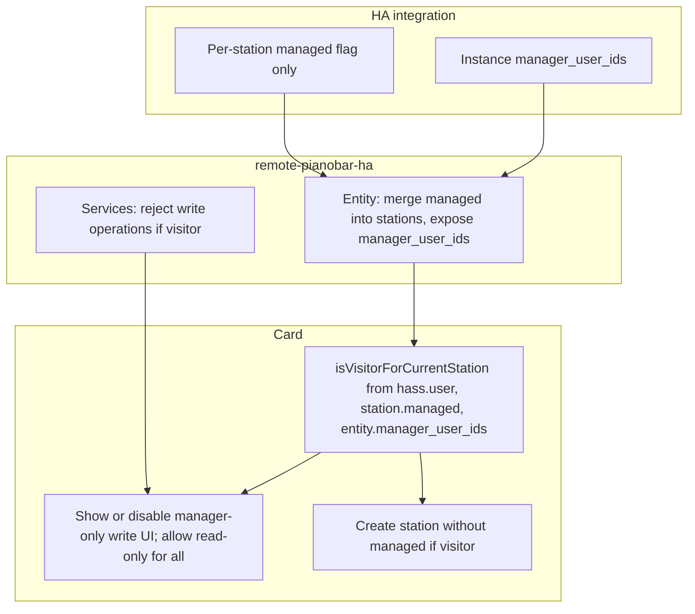

# Visitor mode and managed stations

## Goals

- **Visitor**: User who is **not** in the **instance-level** manager list when the **current** station is **managed**. Visitors can: **all read-only operations** (e.g. explain song, upcoming, view station info), plus play/pause/next, change station, create new stations (but cannot mark them as managed).
- **Manager**: User in the integration's **instance-level** `manager_user_ids` list. Full **write** access on managed stations: ratings, rename, delete, station mode, add music, edit seeds/feedback, set station managed. (Managers also have read-only; the distinction is that visitors are restricted only on writes.)
- **Unmanaged station**: Station is not marked managed; everyone has full access (current behavior).
- **New stations**: A visitor can create stations; they cannot mark them as managed. Only users in the instance-level manager list can mark a station as managed.
- **Edit manager list**: **Anyone who has access to editing the dashboard** (Lovelace / integration config) can edit the instance-level manager list. Not restricted to users already in `manager_user_ids`; gated only by HA's normal dashboard/config edit permissions.

## Concepts

| Concept                 | Definition                                                                                                                                                                        |
| ----------------------- | --------------------------------------------------------------------------------------------------------------------------------------------------------------------------------- |
| Manager list            | **Instance-level** `manager_user_ids: string[]` – one list for the whole Pianobar integration. Editable by anyone who can edit the dashboard; not restricted to current managers. |
| Managed station         | Station has a flag `managed: true` only. No per-station manager list.                                                                                                             |
| Visitor (for station S) | Current user is not in the **instance-level** `manager_user_ids` and station S is managed.                                                                                        |
| Visitor operations      | **All read-only** (explain song, upcoming, view station info, etc.), plus play, pause, next, select source, create station (without setting managed).                             |
| Manager-only (write)    | Ratings (love/ban/tired), rename station, delete station, station mode, add music, edit seeds/feedback, set station managed. Explain song and upcoming are **not** manager-only.  |

## Where to store state

- **Instance-level** `manager_user_ids: string[]` – store in the **HA integration** (remote-pianobar-ha) at config entry level: e.g. config entry options (editable via Options flow) or a single AsyncStore key for the entry. One list for the whole instance.
- **Per-station** only `managed: boolean` – which stations are managed. Use AsyncStore keyed by config entry + station_id, value `{ "managed": bool }` (or a set of managed station_ids). No per-station manager list.
- **Entity attributes**: Merge per-station `managed` into each station in `stations`; expose instance-level `manager_user_ids` once (e.g. top-level attribute `manager_user_ids`) so the card can compute visitor.
- **Service calls** receive `call.context.user_id`. Allow manager-only operations only if the current/target station is not managed, or if `call.context.user_id` is in the instance-level `manager_user_ids`.

## Backend (remote-pianobar-ha)

### 1. Persistence

- **Instance-level** `manager_user_ids: string[]`: store in config entry options (Options flow) or a single AsyncStore key for the entry. Load when coordinator/entity starts; update when user edits managers (service or options flow).
- **Per-station** `managed: bool` only: store in AsyncStore keyed by config entry + station_id, value e.g. `{ "managed": bool }`. Load/store when building entity attributes and when `set_station_managed` is called.

### 2. Expose in entity

- In [media_player.py](remote-pianobar-ha/custom_components/pianobar/media_player.py): (1) Add top-level attribute **manager_user_ids** (the instance-level list) so the card can compute visitor. (2) When building `extra_state_attributes["stations"]`, merge per-station `managed` only (add `managed: bool` per station). No per-station manager list.

### 3. Policy: who can set a station as managed / edit manager list

- **Set station managed/unmanaged**: Only users in the **instance-level** `manager_user_ids` can call `set_station_managed`.
- **Edit manager_user_ids**: **Anyone who can edit the dashboard** can edit the manager list (e.g. via Options flow or service `set_manager_users`). Do **not** restrict to users already in `manager_user_ids`; rely on HA's normal permissions for config/dashboard editing. So backend does **not** reject `set_manager_users` based on caller being in the list.

### 4. Service enforcement

- **Manager-only (write) services** – reject if current/target station is managed and `call.context.user_id` not in **instance-level** `manager_user_ids`:
  - `love_song`, `ban_song`, `tired_of_song` – current station.
  - `rename_station`, `delete_station` – target station (station_id in call).
  - Station mode, add music, delete_seed, delete_feedback (and any other write operations on station/seeds). get_station_info and explain_song, get_upcoming are read-only and **allowed for visitors**.
- **Visitor-allowed (read-only and playback)**: `explain_song`, `get_upcoming`, play, pause, next, select source, create_station, create_station_from_music_id (without setting managed if caller not in manager_user_ids). Any other read-only operations are also visitor-allowed.
- Do **not** restrict `explain_song` or `get_upcoming` by manager list; they are allowed for visitors.

### 5. New or extended services

- **set_station_managed**: `station_id`, `managed` (bool). Allowed only if `call.context.user_id` is in instance-level `manager_user_ids`.
- **set_manager_users** (optional): `manager_user_ids` (list). **No backend check** that caller is in the list; any authenticated user who can call the service (e.g. from dashboard config) can update it. Access is gated by who can edit the dashboard/card/integration options.

## Card (remote_pianobar_card)

### 1. Types

- Extend [Station](remote_pianobar_card/src/types.ts): add `managed?: boolean` only (no per-station manager_user_ids).
- Entity attributes: card reads **manager_user_ids** from the entity's top-level attribute (instance-level list) and each station's **managed** flag.
- Ensure `HomeAssistant` has `user?: { id: string; name?: string }` (for current user).

### 2. Visitor vs manager for current station

- Add helper: **isVisitorForCurrentStation()**: true if (1) the **current** station (from entity, e.g. `media_content_id`) has `managed === true`, and (2) `hass.user?.id` is **not** in the entity's **manager_user_ids** (instance-level attribute). If station is missing or not managed, return false (everyone has full access). If manager_user_ids is missing/empty, treat as no restrictions (or treat as "no managers" so everyone is visitor on managed stations – decide consistently with backend).

### 3. Show/hide or disable UI

- **Manager-only (hide or disable for visitors):** Rating UI (inline love/ban/tired and overflow "Song Ratings"), overflow items: Rename, Delete, Station mode, Station info / Manage seeds & feedback, Add music. Optionally show as disabled with tooltip "Manager only".
- **Allowed for everyone (including visitors):** All read-only: **Explain song**, **Upcoming**, view station info (if split from "manage seeds"). Plus play, pause, next, station selector, Create station (without "managed" option for visitors).
- **Create station flow:** If current user is visitor (not in instance-level manager_user_ids), do not show "Managed" checkbox; new station is created as unmanaged. If user is manager, allow sending "mark as managed" when creating (if backend supports it).

### 4. Set station managed / edit manager list

- **Per station:** In overflow or station info, add "Mark as managed" / "Mark as unmanaged" for the **current** station. Only show if current user is in entity attribute **manager_user_ids**. Call service `set_station_managed` with station_id and managed (bool). No per-station manager list to edit.
- **Edit manager list (instance-level):** Available to **anyone who can edit the dashboard** (card config or integration Options). Do **not** restrict to users in manager_user_ids. Expose in card editor or integration Options (e.g. "Manager users" field with person-based selector). Backend does not reject edits based on caller; access is gated by HA's dashboard/config edit permissions.

## Data flow (high level)

## Files to touch (summary)

| Area                       | Files                                                                                    | Changes                                                                                                                                                                                                 |
| -------------------------- | ---------------------------------------------------------------------------------------- | ------------------------------------------------------------------------------------------------------------------------------------------------------------------------------------------------------- |
| Backend store / options    | Config entry options or AsyncStore; per-station AsyncStore                               | Instance-level manager_user_ids. Per-station: station_id -> { managed } only.                                                                                                                          |
| Backend entity             | [media_player.py](remote-pianobar-ha/custom_components/pianobar/media_player.py)        | Expose manager_user_ids (instance-level). Merge per-station managed into each station in stations list.                                                                                                  |
| Backend services           | [__init__.py](remote-pianobar-ha/custom_components/pianobar/__init__.py), services.yaml  | Reject write services if station managed and context.user_id not in manager_user_ids. Allow explain_song, get_upcoming for all. Add set_station_managed; optional set_manager_users (no caller check).   |
| Card types                 | [types.ts](remote_pianobar_card/src/types.ts)                                           | Station: managed? only. Entity attr: manager_user_ids?.                                                                                                                                                  |
| Card main                  | [pianobar-media-player-card.ts](remote_pianobar_card/src/pianobar-media-player-card.ts) | isVisitorForCurrentStation(); gate only write UI (ratings, rename, delete, station mode, station info, add music). Allow Explain song, Upcoming for all. Create-station "managed" only for managers.     |
| Card create station        | Create-station modal / add-music flow                                                    | Hide "managed" option when visitor.                                                                                                                                                                     |
| Card overflow / settings   | Overflow menu; card editor or Options                                                    | "Mark as managed/unmanaged" when user is manager. Edit manager list: anyone who can edit dashboard; no manager check.                                                                                    |

## Edge cases

- **No hass.user**: Treat as visitor (hide manager-only UI, backend rejects manager-only calls if context has no user_id).
- **Unmanaged station**: No manager list; everyone has full access (no change to current behavior).
- **New station created by visitor**: Backend must not accept managed=true from that caller (or card does not send it). New station appears as unmanaged.
- **Bootstrap**: Set initial manager_user_ids via Config Entry Options or card/integration config; anyone with dashboard edit access can do it.

## Open decisions

1. **Where to edit manager_user_ids**: Config Entry Options flow only, or also a service / card config field so anyone with dashboard edit access can change it from the card.
2. **Add music**: Treat as manager-only (visitor can create new stations but not add music to an existing managed station).
