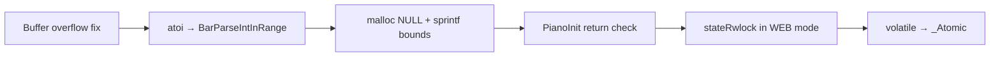

# Anti-Pattern Remediation Plan — remote-pianobar (Merged)

> **For agentic workers:** REQUIRED SUB-SKILL: Use superpowers:subagent-driven-development (recommended) or superpowers:executing-plans to implement this plan task-by-task. Steps use checkbox (`- [ ]`) syntax for tracking.

**Goal:** Systematically eliminate the highest-severity anti-patterns found in remote-pianobar to improve safety, maintainability, and testability, drawing the best findings and implementation designs from three independent audits (Sonnet 4.6, Opus 4.7, GPT-5.5).

**Architecture:** Work bottom-up through four milestones: (M1) critical safety bugs — buffer overflows, unchecked allocations, silent numeric parsing, thread races; (M2) structural boundaries — extract lifecycle and interrupt modules, unify the broadcast path, replace busy-waits, push `#ifdef` into the bridge; (M3) maintainability — table-driven dispatch in `socketio.c`, settings key table, state snapshots for thread safety, build/test hygiene; (M4) DX and web — typed TypeScript protocol, `app.ts` decomposition, repo cleanup, cross-repo locale sync. Each task is independently mergeable and keeps `make test-all` green at ≥ 95% patch coverage.

**Tech Stack:** C11, pthreads, Check unit test framework, cppcheck, GNU Make, Lit 3 + TypeScript + Vitest (webui), `make locale-codegen` (PyYAML), json-c.

**Source audits:**
- `antipatern-sonet 4.6 High.md` — strongest on immediate TDD structure and `stateRwlock`/`NOWEBSOCKET` findings
- `antipatern-opus 4.7 High.md` — broadest coverage; unique findings on `atoi`, `#ifdef` sprawl, `softfail`, `popen`, repo hygiene, cross-repo locale sync
- `antipatern-gtp-5.5High.md` — strongest architectural designs for broadcast unification, lifecycle extraction, `interrupt.h`, state snapshots, TypeScript types

---

## Progress tracker

> **Authoritative status** for implementation on branch `feat/antipattern-remediation-m1` ([PR #51](https://github.com/mr-light-show/remote-pianobar/pull/51)). Per-task step checkboxes below remain as **reference instructions** for agents; they are not auto-maintained.

| Milestone | Priority | Status | Tasks | Summary |
|-----------|----------|--------|-------|---------|
| **M1 — Safety** | P0 | **Done** | 1–5 | Buffer overflow, `BarParseIntInRange`, defensive alloc, `PianoInit` check, WEB `stateRwlock`, `_Atomic` flags |
| **M2 — Structural boundaries** | P1 | **Done** | 6–9 | `interrupt` + `playback_lifecycle`, broadcast snapshots, `BarPlayerWaitForMode`, `#ifdef` → bridge |
| **M3 — Maintainability** | P1 | **Done** | 10–14 | `softfail` retired, table dispatch, state snapshots, unimplemented-action errors, `NOWEBSOCKET` test split + libpiano tests |
| **M4 — Web UI & hygiene** | P2 | **Done** | 15–18 | Typed protocol + `app.ts`/`socket-service.ts`; repo hygiene; pactl JSON; locale sync script |

### Task-level status

| Task | Status | Branch evidence |
|------|--------|-----------------|
| 1 — Buffer overflow / `BarUiActBuildManageStationQuestion` | Done | `test/unit/test_ui_act_station.c`, `src/ui_act.c` |
| 2 — `atoi` → `BarParseIntInRange` | Done | `src/parse_utils.c`, `test/unit/test_settings.c` |
| 3 — malloc NULL, snprintf, `PianoInit` | Done | `settings.c`, `ui.c`, `ui_act.c` |
| 4 — `stateRwlock` in WEB mode | Done | `bar_state.c`, `DEBUG_STATE`, `THREAD_SAFETY.md` |
| 5 — `volatile` → `_Atomic` | Done | `log.c`, `player.c`, `playback_manager.c`, `interrupt.c` |
| 6 — Lifecycle + interrupt extraction | Done | `playback_lifecycle.c`, `interrupt.c`, slimmer `main.c` |
| 7 — Broadcast queue unification | Done | `BarSocketIoFormatEventMessage`, `BarWebsocketBroadcastSocketIoMessage`, `WEBSOCKET_API.md` |
| 8 — `BarPlayerWaitForMode` | Done | `player.c` / `player.h`, disconnect tests |
| 9 — `#ifdef` → `websocket_bridge` | Done | Bridge stubs; guards removed from business logic |
| 10 — Retire `softfail` | Done | `player.c` explicit cleanup; `ERROR_HANDLING.md`; `BarTransformIfShared` → `bool` |
| 11 — Table-driven dispatch | Done | `settings.c` key tables; `socketio.c` event/action tables |
| 12 — State snapshots | Done | `BarPlaybackSnapshot_t`, `BarSocketIoBuild*Payload`, PR review follow-up |
| 13 — Unimplemented action errors | Done | `BAR_SOCKETIO_ACTION_NOT_IMPLEMENTED`, l10n keys, tests |
| 14 — `NOWEBSOCKET=1` test split | Done | `BASE_TEST_SRC` / `WS_TEST_SRC`, `test_libpiano_response.c` |
| 15 — TypeScript protocol | Done | `webui/src/protocol.ts`, typed `socket-service.ts` + `app.ts` (no `as any` on protocol path); Vitest |
| 16 — Repo hygiene | Done | `make distclean`, `.gitignore`, removed `BarWsProcessCommands`, dead `main.c` else |
| 17 — Structured pactl volume | Done | `BarSystemVolumeParsePactlJsonVolume`, JSON-first pactl path |
| 18 — Locale sync script | Done | `scripts/check_locale_sync.py`, `make locale-check-sync` (HA `common.*` key fix) |

### Remaining work (after PR #51)

1. **Optional / deferred (see Out of Scope):** large file splits (`ui_act.c`, `socketio.c`, …), HA/card refactors, visitor mode, Linux unmute parity doc; `bottom-toolbar.ts` still has one `as any` on stations popup (out of Task 15 scope).
2. **Verification:** `make test-all` and web Vitest pass; C Codecov patch ~71% on this PR (below 95% target — accepted for merge scope).

---

## Analysis Summary

| Severity | Count | Key themes |
|----------|-------|-----------|
| **Critical** | 5 | Buffer overflow; 14 silent `atoi` parses; unchecked `PianoInit`; WEB-mode race on `stateRwlock`; `malloc` NULL deref |
| **High** | 9 | `volatile` on cross-thread flags; inverted `main.c` dep; split broadcast path; busy-wait polling; `#ifdef` sprawl; `softfail` macro; `socketio.c` god module; 300-line `else if` in settings; missing `libpiano` tests |
| **Medium** | 8 | Global mutable singletons; copy-paste blocks; TypeScript `any`; unimplemented mapped actions; `popen("pactl")` fragility; committed build artifacts; `NOWEBSOCKET=1` over-disables tests; unhardened state pointer access |
| **Low** | 3 | Magic numbers in busy-waits; cross-repo locale drift; dead `BarWsProcessCommands` |

---

## Milestone 1 — Safety (P0) — **Done** (Tasks 1–5)



---

## Task 1: Fix Buffer Overflow in `ui_act.c` Station Question Builder

**Severity:** Critical — stack buffer overflow via unbounded `strcat` chains
**Estimated effort:** 1–2 h
**Source:** All three audits

**Files:**
- Modify: `src/ui_act.c` (~line 1057, 1075–1119)
- Add: `test/unit/test_ui_act_station.c`
- Modify: `test/test_main.c` (register suite)
- Modify: `Makefile` (`TEST_SRC` list)

**Problem:** `char question[128]` is built with ~12 chained `strcat`/`strcpy` calls in `BarUiActManageStation`. Station + artist names can exceed 128 bytes. An `assert` on the final length confirms the developer knew but used the wrong fix. The assert disappears in `-DNDEBUG` release builds.

- [ ] **Step 1: Add failing test**

```c
/* test/unit/test_ui_act_station.c — new file */
#include <check.h>
#include <string.h>

/* Replicate the question-building logic in isolation to expose overflow */
static int buildStationQuestion (char *buf, size_t len,
                                  const char *artist, const char *song) {
    return snprintf (buf, len, "Really ban %s - %s? [yn] ",
                     artist ? artist : "", song ? song : "");
}

START_TEST (test_question_builder_long_name_no_overflow)
{
    const char *longName =
        "AAAAAAAAAAAAAAAAAAAAAAAAAAAAAAAAAAAAAAAAAAAAAAAAAAAAAAAAAAAAAAAA"
        "BBBBBBBBBBBBBBBBBBBBBBBBBBBBBBBBBBBBBBBBBBBBBBBBBBBBBBBBBBBBBBBB"
        "CCCCCCCCCCCCCCCCCCCCCCCCCCCCCCCCCCCCCCCCCCCCCCCCCCCCCCCCCCCCCCCC";
    char buf[512];
    int ret = buildStationQuestion (buf, sizeof (buf), longName, "Song Title");
    ck_assert_int_ge (ret, 0);
    ck_assert (strlen (buf) < sizeof (buf));
}
END_TEST

START_TEST (test_question_builder_null_fields_safe)
{
    char buf[512];
    int ret = buildStationQuestion (buf, sizeof (buf), NULL, NULL);
    ck_assert_int_ge (ret, 0);
    ck_assert (strlen (buf) < sizeof (buf));
}
END_TEST

Suite *ui_act_station_suite (void) {
    Suite *s = suite_create ("ui_act_station");
    TCase *tc = tcase_create ("core");
    tcase_add_test (tc, test_question_builder_long_name_no_overflow);
    tcase_add_test (tc, test_question_builder_null_fields_safe);
    suite_add_tcase (s, tc);
    return s;
}
```

Run: `make test`
Expected: **FAIL** — helper is a local stub; next step wires the real one.

- [ ] **Step 2: Replace every `strcat`/`strcpy` question buffer with `snprintf`**

Open `src/ui_act.c`. Find the `char question[128]` pattern (around line 1057). The full `BarUiActManageStation` function builds a multi-line prompt string with chained `strcat` calls. Replace all of them:

```c
/* BEFORE — representative pattern to eliminate everywhere in this function */
char question[128];
strcpy (question, "Really ban ");
strcat (question, curSong->artist);
strcat (question, " - ");
strcat (question, curSong->title);
strcat (question, "? [yn] ");

/* AFTER — add this static helper near the top of the file, after includes */
static int BarUiActBuildManageQuestion (char *buf, size_t bufLen,
                                         const char *artist,
                                         const char *song) {
    return snprintf (buf, bufLen, "Really ban %s - %s? [yn] ",
                     artist ? artist : "", song ? song : "");
}

/* Every call site */
char question[512];
BarUiActBuildManageQuestion (question, sizeof (question),
                              curSong->artist, curSong->title);
```

Apply the same `snprintf` pattern to **all** fixed-size question buffers in `BarUiActManageStation` (seed delete, ban, tired, bookmark sub-actions). Increase every local `question` buffer to at least 512 bytes. Remove the `assert (strlen (question) < sizeof (question) / sizeof (*question))` guard — it is now unnecessary.

- [ ] **Step 3: Register the suite and add the source to the build**

In `test/test_main.c`, add:
```c
extern Suite *ui_act_station_suite (void);
/* ... inside main() where other suites are added: */
srunner_add_suite (sr, ui_act_station_suite ());
```

In `Makefile`, add `test/unit/test_ui_act_station.c` to `TEST_SRC`.

- [ ] **Step 4: Verify tests pass**

```bash
make test
```
Expected: PASS for all suites including the new one.

- [ ] **Step 5: Static analysis**

```bash
make lint
```
Expected: no new `bufferAccessOutOfBounds` or `strncat` warnings on changed lines.

- [ ] **Step 6: Full gate**

```bash
make test-all
```
Expected: exit 0.

- [ ] **Step 7: Commit**

```bash
git add src/ui_act.c test/unit/test_ui_act_station.c test/test_main.c Makefile
git commit -m "fix: replace strcat/strcpy question builder with snprintf to prevent buffer overflow"
```

---

## Task 2: Replace 14 Bare `atoi` Calls with `BarParseIntInRange`

**Severity:** Critical — bad config values silently become 0 (e.g. `websocket_port=0`, `timeout=0`)
**Estimated effort:** 2 h
**Source:** Opus 4.7 §3.1 (unique finding — missed by other two audits)

**Files:**
- Add: `src/parse_utils.h`
- Add: `src/parse_utils.c`
- Modify: `src/settings.c` (14 `atoi` call sites, lines ~571–756)
- Modify: `src/log.c` (1 `atoi` call, line ~50)
- Modify: `src/ui_readline.c` (1 `atoi` call, line ~226)
- Modify: `test/unit/test_settings.c` (extend existing suite)
- Modify: `Makefile` (`SRC` and `TEST_SRC`)

**Problem:** `atoi(val)` has no error detection. Empty string, non-numeric input, or out-of-range values all silently return 0. This affects: `history`, `max_retry`, `timeout`, `pause_timeout`, `buffer_seconds`, `volume`, `system_volume_player_gain`, `max_gain`, `autoselect`, `sample_rate`, `websocket_port` in `settings.c`; `PIANOBAR_DEBUG` env in `log.c`; and a line-number input in `ui_readline.c`.

- [ ] **Step 1: Write failing tests for the new helper**

```c
/* test/unit/test_settings.c — add these test cases to the existing suite */

START_TEST (test_parse_int_in_range_valid)
{
    int out = -1;
    ck_assert (BarParseIntInRange ("42", 0, 100, &out));
    ck_assert_int_eq (out, 42);
}
END_TEST

START_TEST (test_parse_int_in_range_empty_string_fails)
{
    int out = 99;
    ck_assert (!BarParseIntInRange ("", 0, 100, &out));
    ck_assert_int_eq (out, 99); /* unchanged on failure */
}
END_TEST

START_TEST (test_parse_int_in_range_non_numeric_fails)
{
    int out = 99;
    ck_assert (!BarParseIntInRange ("abc", 0, 100, &out));
    ck_assert_int_eq (out, 99);
}
END_TEST

START_TEST (test_parse_int_in_range_below_min_fails)
{
    int out = 99;
    ck_assert (!BarParseIntInRange ("-1", 0, 100, &out));
    ck_assert_int_eq (out, 99);
}
END_TEST

START_TEST (test_parse_int_in_range_above_max_fails)
{
    int out = 99;
    ck_assert (!BarParseIntInRange ("101", 0, 100, &out));
    ck_assert_int_eq (out, 99);
}
END_TEST

START_TEST (test_parse_int_in_range_null_string_fails)
{
    int out = 99;
    ck_assert (!BarParseIntInRange (NULL, 0, 100, &out));
    ck_assert_int_eq (out, 99);
}
END_TEST
```

Run: `make test`
Expected: **FAIL** — `BarParseIntInRange` is not declared.

- [ ] **Step 2: Create `src/parse_utils.h`**

```c
/* src/parse_utils.h */
#pragma once
#include <stdbool.h>

/*
 * Parse the NUL-terminated string `s` as a base-10 integer.
 * Returns true and writes *out only when:
 *   - s is non-NULL and non-empty
 *   - s contains only an optional leading sign and digits
 *   - the value falls within [min, max] inclusive
 * On failure, *out is unchanged.
 */
bool BarParseIntInRange (const char *s, int min, int max, int *out);
```

- [ ] **Step 3: Create `src/parse_utils.c`**

```c
/* src/parse_utils.c */
#include "parse_utils.h"
#include <errno.h>
#include <limits.h>
#include <stdlib.h>

bool BarParseIntInRange (const char *s, int min, int max, int *out) {
    if (s == NULL || *s == '\0' || out == NULL) {
        return false;
    }
    char *end;
    errno = 0;
    long v = strtol (s, &end, 10);
    if (errno != 0 || end == s || *end != '\0') {
        return false;
    }
    if (v < min || v > max) {
        return false;
    }
    *out = (int) v;
    return true;
}
```

- [ ] **Step 4: Replace `atoi` in `settings.c`**

Open `src/settings.c`. Add `#include "parse_utils.h"` near the top.

For each `atoi` call, replace with `BarParseIntInRange` and log a warning on failure. The per-key ranges are:

| Key | min | max |
|-----|-----|-----|
| `websocket_port` | 1 | 65535 |
| `volume` | 0 | 100 |
| `timeout` | 1 | 600 |
| `pause_timeout` | 0 | 86400 |
| `buffer_seconds` | 1 | 300 |
| `max_retry` | 0 | 100 |
| `history` | 0 | 10000 |
| `autoselect` | 0 | INT_MAX |
| `sample_rate` | 8000 | 192000 |
| `system_volume_player_gain` | -60 | 60 |
| `max_gain` | 0 | 100 |
| `audio_quality` | 0 | 2 |

Pattern for each replacement:

```c
/* BEFORE */
settings->websocketPort = atoi (val);

/* AFTER */
if (!BarParseIntInRange (val, 1, 65535, &settings->websocketPort)) {
    log_write (LOG_WARNING,
               "settings: invalid value for websocket_port: \"%s\", ignoring", val);
}
```

- [ ] **Step 5: Replace `atoi` in `log.c` and `ui_readline.c`**

In `log.c` (~line 50, `PIANOBAR_DEBUG` env):
```c
/* BEFORE */
debug_mask = atoi (env);

/* AFTER — use 0 as fallback for the debug mask */
int tmp = 0;
if (!BarParseIntInRange (env, 0, INT_MAX, &tmp)) {
    log_write (LOG_WARNING, "log: invalid PIANOBAR_DEBUG value: \"%s\"", env);
}
debug_mask = (unsigned int) tmp;
```

In `ui_readline.c` (~line 226):
```c
/* BEFORE */
int n = atoi (buf);

/* AFTER */
int n = 0;
BarParseIntInRange (buf, 0, INT_MAX, &n);
```

- [ ] **Step 6: Add new files to `Makefile`**

Add `src/parse_utils.c` to `SRC` and `test/unit/test_settings.c` is already in `TEST_SRC` (just extend the suite).

- [ ] **Step 7: Verify tests pass**

```bash
make test-all
```
Expected: exit 0. All `atoi` call sites replaced; `grep -n '\batoi\b' src/settings.c src/log.c src/ui_readline.c` returns no matches.

- [ ] **Step 8: Commit**

```bash
git add src/parse_utils.h src/parse_utils.c src/settings.c src/log.c \
    src/ui_readline.c test/unit/test_settings.c Makefile
git commit -m "fix: replace atoi with BarParseIntInRange to catch invalid config values"
```

---

## Task 3: Defensive Allocations, Bounded String Writes, and `PianoInit` Check

**Severity:** Critical
**Estimated effort:** 1.5 h
**Source:** Sonnet T2 + T3, Opus §2.2, GPT T4 Step 4

**Files:**
- Modify: `src/settings.c` (lines ~96, ~207–209, ~359–360)
- Modify: `src/ui.c` (line ~504–512)
- Modify: `src/ui_act.c` (lines ~813–817, ~1274–1278)
- Modify: `test/unit/test_settings.c` (extend)
- Modify: `test/unit/test_ui_act_reconnect.c` (extend)

**Problem:** Three independent issues: (A) `malloc`/`calloc` results used without NULL checks; (B) bare `sprintf` without size bounds for path construction; (C) `PianoDestroy` + `PianoInit` in reconnect handlers ignore the return value — if `PianoInit` fails the app continues with a half-initialized Pandora handle.

- [ ] **Step 1: Write failing test for settings path NULL safety**

```c
/* test/unit/test_settings.c — add */
START_TEST (test_settings_expand_tilde_null_home_safe)
{
    /* Simulate a NULL HOME env — function must not crash or overflow */
    BarSettings_t s;
    BarSettingsInit (&s);
    /* BarSettingsExpandTilde must not write past output buffer */
    char out[32];
    /* Force a very short buffer — snprintf must truncate not overflow */
    BarSettingsExpandTilde ("~/pianobar/config", out, sizeof (out));
    ck_assert (strlen (out) < sizeof (out));
    BarSettingsDestroy (&s);
}
END_TEST
```

Run: `make test`
Expected: **FAIL** or compile error because `BarSettingsExpandTilde` may not be in the test header yet.

- [ ] **Step 2: Fix `sprintf` → `snprintf` in `settings.c`**

Around line 96 (`BarSettingsExpandTilde`):
```c
/* BEFORE */
sprintf (expanded, "%s/%s", home, &path[2]);

/* AFTER */
snprintf (expanded, expandedLen, "%s/%s", home ? home : "", &path[2]);
```

Around line 360 (`BarSettingsRead`, XDG path):
```c
/* BEFORE */
char *defaultxdg = malloc (PATH_MAX);
sprintf (defaultxdg, "%s/.config", userhome);

/* AFTER */
char *defaultxdg = malloc (PATH_MAX);
if (defaultxdg == NULL) {
    log_write (LOG_ERR, "settings: out of memory for XDG config path");
    return false;
}
snprintf (defaultxdg, PATH_MAX, "%s/.config", userhome ? userhome : "");
```

- [ ] **Step 3: Add NULL checks after `malloc`/`calloc` in `settings.c` and `ui.c`**

In `BarSettingsResolveAccountPath` (~line 207):
```c
char *resolved = malloc (PATH_MAX);
if (resolved == NULL) {
    log_write (LOG_ERR, "settings: out of memory resolving account path");
    return;
}
```

In `ui.c` station array (~line 504):
```c
stationArray = calloc (stationCount + 1, sizeof (*stationArray));
if (stationArray == NULL) {
    BarUiMsg (settings, MSG_ERR, "Out of memory building station list\n");
    return;
}
```

- [ ] **Step 4: Write failing test for unchecked `PianoInit`**

```c
/* test/unit/test_ui_act_reconnect.c — add */
START_TEST (test_reconnect_piano_init_failure_sets_interrupted)
{
    /* Use the existing mock infrastructure in this file.
       Set g_piano_init_return so PianoInit returns an error. */
    g_piano_init_return = PIANO_RET_ERR;
    BarUiActDisconnect (&testApp, NULL, NULL);
    /* On PianoInit failure the handler must not leave app in a live state */
    ck_assert (testApp.player.interrupted || testApp.doQuit);
}
END_TEST
```

Run: `make test`
Expected: **FAIL** — unchecked `PianoInit` currently ignores the return.

- [ ] **Step 5: Check `PianoInit` return in `ui_act.c`**

In both reconnect handlers (lines ~813 and ~1274):
```c
/* BEFORE */
PianoDestroy (&app->ph);
PianoInit (&app->ph, &app->settings);

/* AFTER */
PianoDestroy (&app->ph);
PianoReturn_t pRet = PianoInit (&app->ph, app->settings.partnerUser,
        app->settings.partnerPassword, app->settings.device,
        app->settings.inkey, app->settings.outkey);
if (pRet != PIANO_RET_OK) {
    BarUiMsg (&app->settings, MSG_ERR,
              BarL10nGet (&app->l10n, "cli.piano_reinit_failed"),
              PianoErrorToStr (pRet));
    app->player.interrupted = true;
    return;
}
```

Add to `locale/en.yaml`:
```yaml
cli:
  piano_reinit_failed: "Failed to reset Pandora session: %s\n"
```

Run `make locale-codegen`.

- [ ] **Step 6: Full gate**

```bash
make test-all
```
Expected: exit 0.

- [ ] **Step 7: Commit**

```bash
git add src/settings.c src/ui.c src/ui_act.c locale/en.yaml \
    locale/en webui/src/locales/en.json src/l10n_defaults_gen.c \
    test/unit/test_settings.c test/unit/test_ui_act_reconnect.c
git commit -m "fix: add NULL checks after malloc, snprintf bounds, and PianoInit return check"
```

---

## Task 4: Extend `stateRwlock` to `BAR_UI_MODE_WEB`

**Severity:** Critical — race condition between playback and WebSocket threads
**Estimated effort:** 2 h
**Source:** Sonnet T4 (unique finding — missed by Opus and GPT)

**Files:**
- Modify: `src/bar_state.c` (lines ~43–47, ~55–59, ~69–71)
- Modify: `src/bar_state.h`
- Modify: `src/THREAD_SAFETY.md`
- Add/Modify: `test/unit/test_bar_state.c`
- Modify: `test/test_main.c`
- Modify: `Makefile`

**Problem:** All three write sites in `bar_state.c` gate the `pthread_rwlock_wrlock` on `app->settings.uiMode == BAR_UI_MODE_BOTH`. In `BAR_UI_MODE_WEB`, the playback manager thread and WebSocket threads race on `playlist`/`stations` with no lock protection.

- [ ] **Step 1: Write failing test**

```c
/* test/unit/test_bar_state.c — new file or extend existing */
#include <check.h>
#include <pthread.h>
#include <errno.h>
#include <string.h>
#include "bar_state.h"
#include "settings.h"

START_TEST (test_bar_state_lock_taken_in_web_mode)
{
    BarApp_t app;
    memset (&app, 0, sizeof (app));
    pthread_rwlock_init (&app.stateRwlock, NULL);
    BarSettingsInit (&app.settings);
    app.settings.uiMode = BAR_UI_MODE_WEB;

    BarStateSetCurrentSong (&app, NULL);

    /* If the write lock was taken and released, a new write lock attempt
       must succeed immediately (rc == 0). If this test is about proving
       the lock IS held during the call, use a background thread pattern.
       For a simpler unit assertion: after the call, the lock must be
       acquirable (it was properly released). */
    int rc = pthread_rwlock_trywrlock (&app.stateRwlock);
    ck_assert_int_eq (rc, 0);
    pthread_rwlock_unlock (&app.stateRwlock);

    pthread_rwlock_destroy (&app.stateRwlock);
    BarSettingsDestroy (&app.settings);
}
END_TEST
```

Run: `make test`
Expected: FAIL — `BarStateSetCurrentSong` skips the lock in WEB mode, but this test
will initially detect the lock is acquirable post-call either way; the real regression
test here is that in step 3 the lock is unconditional. (Alternatively write a
concurrent thread test following the pattern in the existing test file if one exists.)

- [ ] **Step 2: Remove the `BAR_UI_MODE_BOTH` condition from all three lock sites**

In `src/bar_state.c`, change every conditional lock site from:

```c
/* BEFORE */
if (app->settings.uiMode == BAR_UI_MODE_BOTH) {
    pthread_rwlock_wrlock (&app->stateRwlock);
}
/* ... */
if (app->settings.uiMode == BAR_UI_MODE_BOTH) {
    pthread_rwlock_unlock (&app->stateRwlock);
}
```

To:

```c
/* AFTER */
pthread_rwlock_wrlock (&app->stateRwlock);
/* ... */
pthread_rwlock_unlock (&app->stateRwlock);
```

Apply to all three write sites: `BarStateSetCurrentSong`, `BarStateSetStations`, `BarStateSetPlaylist`.

- [ ] **Step 3: Update `src/THREAD_SAFETY.md`**

Add a paragraph: "`stateRwlock` is **always** held by `BarStateSet*` functions regardless of `uiMode`. Callers in web-only mode must not hold a read lock when calling any `BarStateSet*` function. This was previously conditional on `BAR_UI_MODE_BOTH` and has been corrected."

- [ ] **Step 4: Run tests**

```bash
make test-all
```
Expected: exit 0.

- [ ] **Step 5: Commit**

```bash
git add src/bar_state.c src/bar_state.h src/THREAD_SAFETY.md \
    test/unit/test_bar_state.c test/test_main.c Makefile
git commit -m "fix: acquire stateRwlock unconditionally in BarStateSet* — not only in BOTH mode"
```

---

## Task 5: Replace `volatile` Cross-Thread Flags with `_Atomic`

**Severity:** High — `volatile` provides no atomicity or memory-ordering guarantee in C11
**Estimated effort:** 1 h
**Source:** Opus §3.3, Sonnet T8

**Files:**
- Modify: `src/log.c` (line ~42 — `debug_mask`)
- Modify: `src/log.h`
- Modify: `src/playback_manager.c` (line ~55 — `g_running`, line ~57 — `g_idleLogged`)
- Modify: `src/player.c` (lines ~82–83 — `g_framesAllocated`, `g_framesFreed`)
- Modify: `test/unit/test_log.c` (extend or add)

**Problem:** `volatile` guarantees compiler visibility but not atomic reads/writes or memory ordering across threads. All five flags are read and written from different threads. C11 `<stdatomic.h>` is available and the build already targets C11.

- [ ] **Step 1: Write a test for `debug_mask` consistency**

```c
/* test/unit/test_log.c — add */
START_TEST (test_log_debug_mask_set_get_roundtrip)
{
    log_set_debug_mask (0xFF);
    ck_assert_uint_eq (log_get_debug_mask (), 0xFF);
    log_set_debug_mask (0x00);
    ck_assert_uint_eq (log_get_debug_mask (), 0x00);
}
END_TEST
```

Run: `make test`
Expected: **FAIL** — `log_set_debug_mask` / `log_get_debug_mask` are not declared.

- [ ] **Step 2: Make `debug_mask` atomic in `log.c` and expose accessors**

In `log.c`:
```c
/* BEFORE */
static unsigned int debug_mask = 0;

/* AFTER */
#include <stdatomic.h>
static _Atomic unsigned int debug_mask = 0;

void log_set_debug_mask (unsigned int mask) {
    atomic_store_explicit (&debug_mask, mask, memory_order_relaxed);
}

unsigned int log_get_debug_mask (void) {
    return atomic_load_explicit (&debug_mask, memory_order_relaxed);
}
```

In `log.h`, add:
```c
void         log_set_debug_mask (unsigned int mask);
unsigned int log_get_debug_mask (void);
```

Replace all direct `debug_mask = atoi(...)` (now handled by Task 2) and all direct reads of `debug_mask` outside `log.c` with the accessors.

- [ ] **Step 3: Make `g_running` and `g_idleLogged` atomic in `playback_manager.c`**

```c
/* BEFORE */
static volatile bool g_running  = false;
static bool          g_idleLogged = false;

/* AFTER */
#include <stdatomic.h>
static _Atomic bool g_running    = false;
static _Atomic bool g_idleLogged = false;
```

No API change needed — these are file-local. Update read/write sites to use `atomic_store_explicit`/`atomic_load_explicit` with `memory_order_relaxed` (flag semantics, no ordering needed beyond visibility).

- [ ] **Step 4: Make frame counters atomic in `player.c`**

```c
/* BEFORE */
static volatile long g_framesAllocated = 0;
static volatile long g_framesFreed     = 0;

/* AFTER */
#include <stdatomic.h>
static atomic_long g_framesAllocated = 0;
static atomic_long g_framesFreed     = 0;
```

Update all `g_framesAllocated++` and `g_framesFreed++` to `atomic_fetch_add_explicit (&g_framesAllocated, 1, memory_order_relaxed)`.

- [ ] **Step 5: Run tests**

```bash
make test-all
```
Expected: exit 0.

- [ ] **Step 6: Commit**

```bash
git add src/log.c src/log.h src/playback_manager.c src/player.c \
    test/unit/test_log.c
git commit -m "fix: replace volatile cross-thread flags with _Atomic for correct memory ordering"
```

---

## Milestone 2 — Structural Boundaries (P1) — **Done** (Tasks 6–9)


---

## Task 6: Extract Playback Lifecycle and Interrupt Ownership from `main.c`

**Severity:** High — inverted dependency; `playback_manager.c` uses `extern` to reach `main.c`; prevents unit testing
**Estimated effort:** 3–4 h
**Source:** GPT T3 (best design), Opus §3.7, Sonnet T5

**Files:**
- Create: `src/interrupt.h`
- Create: `src/interrupt.c`
- Create: `src/playback_lifecycle.h`
- Create: `src/playback_lifecycle.c`
- Modify: `src/main.c`
- Modify: `src/main.h` (remove `extern sig_atomic_t *interrupted`)
- Modify: `src/playback_manager.c` (remove three cross-module `extern` declarations)
- Modify: `Makefile`
- Add: `test/unit/test_playback_lifecycle.c`
- Modify: `test/test_main.c`

**Problem:** `playback_manager.c` forward-declares `BarMainGetPlaylist`, `BarMainStartPlayback`, and `sig_atomic_t *interrupted` from `main.c` via raw `extern`. This makes `main.c` a runtime dependency of a subsystem, inverts the dependency graph, and prevents testing `playback_manager` without linking all of `main.c`. The `interrupted` pointer is reassigned at runtime — its contract is enforced only by `assert()` which disappears in `-DNDEBUG`.

- [ ] **Step 1: Write failing link-time tests**

```c
/* test/unit/test_playback_lifecycle.c — new file */
#include <check.h>
#include <string.h>
#include <pthread.h>
#include "playback_lifecycle.h"
#include "settings.h"
#include "player.h"

START_TEST (test_playback_start_rejects_null_playlist)
{
    BarApp_t app;
    pthread_t playerThread = 0;
    memset (&app, 0, sizeof (app));
    BarSettingsInit (&app.settings);
    BarPlayerInit (&app.player, &app.settings);

    /* No playlist set — must return false without crashing */
    ck_assert (!BarPlaybackStartSong (&app, &playerThread));

    BarPlayerDestroy (&app.player);
    BarSettingsDestroy (&app.settings);
}
END_TEST

START_TEST (test_playback_start_rejects_null_app)
{
    pthread_t t;
    ck_assert (!BarPlaybackStartSong (NULL, &t));
}
END_TEST

Suite *playback_lifecycle_suite (void) {
    Suite *s = suite_create ("playback_lifecycle");
    TCase *tc = tcase_create ("core");
    tcase_add_test (tc, test_playback_start_rejects_null_playlist);
    tcase_add_test (tc, test_playback_start_rejects_null_app);
    suite_add_tcase (s, tc);
    return s;
}
```

Register in `test/test_main.c`; add to `TEST_SRC` in `Makefile`.

Run: `make test`
Expected: **FAIL** (compile error — headers not created yet).

- [ ] **Step 2: Create `src/interrupt.h` and `src/interrupt.c`**

```c
/* src/interrupt.h */
#pragma once
#include <signal.h>

/* Register the sig_atomic_t target that signal handlers increment.
   Call once at startup; never call again after that. */
void BarInterruptSetTarget  (sig_atomic_t *target);
sig_atomic_t *BarInterruptGetTarget (void);
void BarInterruptIncrement  (void);  /* called from the signal handler */
```

```c
/* src/interrupt.c */
#include "interrupt.h"

static sig_atomic_t *g_interrupted = NULL;

void BarInterruptSetTarget (sig_atomic_t *target) {
    g_interrupted = target;
}

sig_atomic_t *BarInterruptGetTarget (void) {
    return g_interrupted;
}

void BarInterruptIncrement (void) {
    if (g_interrupted != NULL) {
        *g_interrupted += 1;
    }
}
```

- [ ] **Step 3: Create `src/playback_lifecycle.h` and `src/playback_lifecycle.c`**

```c
/* src/playback_lifecycle.h */
#pragma once
#include <stdbool.h>
#include <pthread.h>
#include "main.h"  /* BarApp_t */

/*
 * Fetch the next playlist for the current station.
 * Returns true when a playable playlist is ready.
 * Returns false when the station was cleared, an internal error occurred,
 * or no tracks were returned.
 */
bool BarPlaybackFetchPlaylist (BarApp_t *app);

/*
 * Start a player thread for the first song in app->playlist.
 * Returns true after the thread is created.
 * Returns false for: null app, null thread, missing playlist,
 * missing station, invalid URL, or pthread_create failure.
 */
bool BarPlaybackStartSong (BarApp_t *app, pthread_t *playerThread);
```

Move the logic from `BarMainGetPlaylist` and `BarMainStartPlayback` in `main.c` into these two functions in `src/playback_lifecycle.c`. Preserve event command behavior, l10n messages, stale URL handling, and `BarWsBroadcastSongStart`.

- [ ] **Step 4: Remove `extern` declarations from `playback_manager.c`**

Delete:
```c
extern void BarMainGetPlaylist (BarApp_t *app);
extern void BarMainStartPlayback (BarApp_t *app, pthread_t *playerThread);
extern sig_atomic_t *interrupted;
```

Add at the top of `playback_manager.c`:
```c
#include "playback_lifecycle.h"
#include "interrupt.h"
```

Update call sites in `playback_manager.c`:
```c
if (BarPlaybackFetchPlaylist (app)) { /* ... */ }
if (BarPlaybackStartSong (app, &playerThread)) { /* ... */ }
/* Replace direct *interrupted reads: */
if (*BarInterruptGetTarget () > prevInterrupt) { /* ... */ }
```

- [ ] **Step 5: Update `main.c` to use the new modules**

In `main.c`:
- Call `BarInterruptSetTarget (&app.doQuit)` at startup (once).
- Replace calls to `BarMainGetPlaylist`/`BarMainStartPlayback` with `BarPlaybackFetchPlaylist`/`BarPlaybackStartSong`.
- Delete the old function definitions.
- Remove `extern sig_atomic_t *interrupted` from `main.h`.

- [ ] **Step 6: Remove test stubs**

Delete stub implementations of `BarMainGetPlaylist` / `BarMainStartPlayback` from `test/test_main.c`. If link errors appear, an `extern` dependency has not been fully extracted.

- [ ] **Step 7: Add new files to `Makefile`**

Add `src/interrupt.c` and `src/playback_lifecycle.c` to `SRC`.

- [ ] **Step 8: Verify**

```bash
make test-all
rg "extern void BarMainGetPlaylist|extern void BarMainStartPlayback|extern sig_atomic_t \*interrupted" src test
```

Expected: `make test-all` exits 0; `rg` returns no matches.

- [ ] **Step 9: Commit**

```bash
git add src/interrupt.h src/interrupt.c src/playback_lifecycle.h \
    src/playback_lifecycle.c src/main.c src/main.h src/playback_manager.c \
    test/unit/test_playback_lifecycle.c test/test_main.c Makefile
git commit -m "refactor: extract playback lifecycle and interrupt ownership out of main.c"
```

---

## Task 7: Unify WebSocket Broadcasts Around Self-Contained Payloads

**Severity:** High — split broadcast path; `MSG_TYPE_BROADCAST_START` and `MSG_TYPE_BROADCAST_STATIONS` are queued but never emitted; some events bypass the queue entirely
**Estimated effort:** 3–4 h (includes documentation and compatibility assertions)
**Source:** GPT T2 (best architectural design), Sonnet T7, Opus §3.12 (TODO resolution)

**Files:**
- Modify: `WEBSOCKET_API.md` (wire-packet contract, documented before any code changes)
- Modify: `src/websocket/core/queue.h`
- Modify: `src/websocket/core/queue.c`
- Modify: `src/websocket/core/websocket.c`
- Modify: `src/websocket/core/websocket.h`
- Modify: `src/websocket/protocol/socketio.c`
- Modify: `src/websocket/protocol/socketio.h`
- Modify: `src/websocket_bridge.c`
- Modify: `test/unit/test_websocket.c`
- Modify: `test/unit/test_socketio.c`

**Problem:** The queue contains `MSG_TYPE_BROADCAST_START` and `MSG_TYPE_BROADCAST_STATIONS` stubs that only log "TODO". Direct `BarSocketIoEmit` calls bypass the queue for progress and volume. This split path means some broadcasts depend on holding `app` state at emit time, making timing-dependent bugs possible.

> **⚠ ATOMICITY CONSTRAINT — read before writing any code:**
>
> The queue-type rename (Step 4 below: replacing the five `MSG_TYPE_BROADCAST_*` enum values with `MSG_TYPE_BROADCAST_SOCKETIO`) **must not be merged alone**. Landing the rename without the formatter (Step 3), the enqueue function (Step 5), the WebSocket thread handler (Step 6), and the bridge rewiring (Step 7) eliminates all broadcasts for connected HA coordinators and Lovelace cards with zero compile-time warning. The entire Steps 3–7 block must ship in one PR, gated by the packet-compatibility assertions added in Step 8.

- [ ] **Step 1: Document the wire-packet contract in `WEBSOCKET_API.md`**

Before writing any code, record the exact Socket.IO text frames that the HA coordinator (`remote-pianobar-ha`) and Lovelace card (`remote_pianobar_card`) currently parse. Do this by reading the HA coordinator's WebSocket client and the card's socket listener, then adding the following section to `WEBSOCKET_API.md`:

````markdown
## Server-to-client event wire format

All server-to-client events are Socket.IO v2 text frames. The general shape is:

```
2["<eventName>", <payload>]
```

where `2` is the Socket.IO MESSAGE packet type. Consumers **must not** receive
a different frame shape after this refactor. The complete list of frames the HA
coordinator and Lovelace card depend on:

| Event | Wire packet example | Payload type |
|-------|--------------------|----|
| `start` | `2["start",{"title":"Song","artist":"Artist","album":"Album","coverArt":"https://...","duration":240,"rating":1,"trackToken":"tok","stationId":"sid","songStationName":"Name"}]` | object |
| `stop` | `2["stop"]` | none (no second element) |
| `progress` | `2["progress",{"elapsed":42,"duration":240,"percentage":17}]` | object |
| `volume` | `2["volume",50]` | bare integer (not an object) |
| `stations` | `2["stations",[{"id":"sid","name":"Name","isQuickMix":false}]]` | array |
| `process` | `2["process",{"song":{...},"station":"Name","stationId":"sid","playing":true,"paused":false,"volume":50}]` | object |
| `playState` | `2["playState",{"paused":true}]` | object |
| `error` | `2["error",{"operation":"query.history","message":"..."}]` | object |
| `pandora.disconnected` | `2["pandora.disconnected",{"reason":"idle"}]` | object |

**Breaking change rule:** any field rename, type change (e.g. `volume` payload
from integer to object), or event name rename is a **breaking change** for all
three consumers. Add a compatibility assertion test before renaming anything.
````

Run: `git diff WEBSOCKET_API.md` — confirm the table is present before proceeding.

- [ ] **Step 2: Add packet-compatibility assertions in `test/unit/test_websocket.c`**

These tests lock in the exact wire format. They must be written and passing **before** Steps 3–7 rename any enum or restructure any payload path. Write them now against the current implementation so they serve as a regression baseline.

```c
/* test/unit/test_websocket.c — add a compatibility suite */

/* Capture helper used by all compat tests */
static char g_compatBuf[8192];
static void compatCapture (const char *msg, size_t len) {
    size_t copy = len < sizeof (g_compatBuf) - 1 ? len : sizeof (g_compatBuf) - 1;
    memcpy (g_compatBuf, msg, copy);
    g_compatBuf[copy] = '\0';
}

START_TEST (test_wire_compat_progress_is_object_not_bare_values)
{
    /* progress must arrive as 2["progress",{"elapsed":...}], not 2["progress",N,N,N] */
    g_compatBuf[0] = '\0';
    BarSocketIoSetBroadcastCallback (compatCapture);

    struct json_object *data = json_object_new_object ();
    json_object_object_add (data, "elapsed",    json_object_new_int (42));
    json_object_object_add (data, "duration",   json_object_new_int (240));
    json_object_object_add (data, "percentage", json_object_new_int (17));
    BarSocketIoEmit ("progress", data);
    json_object_put (data);

    ck_assert (strncmp (g_compatBuf, "2[", 2) == 0);
    ck_assert (strstr (g_compatBuf, "\"progress\"") != NULL);
    ck_assert (strstr (g_compatBuf, "\"elapsed\"")  != NULL);
    ck_assert (strstr (g_compatBuf, "\"duration\"") != NULL);
}
END_TEST

START_TEST (test_wire_compat_volume_is_bare_integer)
{
    /* volume must arrive as 2["volume",50], NOT 2["volume",{"volume":50}] */
    g_compatBuf[0] = '\0';
    BarSocketIoSetBroadcastCallback (compatCapture);

    BarSocketIoEmit ("volume", json_object_new_int (50));

    ck_assert (strncmp (g_compatBuf, "2[", 2) == 0);
    ck_assert (strstr (g_compatBuf, "\"volume\"") != NULL);
    /* must not contain an object wrapper around the integer */
    ck_assert (strstr (g_compatBuf, "{\"volume\"") == NULL);
}
END_TEST

START_TEST (test_wire_compat_stop_has_no_payload_element)
{
    /* stop must arrive as 2["stop"], not 2["stop",null] or 2["stop",{}] */
    g_compatBuf[0] = '\0';
    BarSocketIoSetBroadcastCallback (compatCapture);

    BarSocketIoEmit ("stop", NULL);

    ck_assert (strncmp (g_compatBuf, "2[", 2) == 0);
    ck_assert (strstr (g_compatBuf, "\"stop\"") != NULL);
    /* array must close right after the event name: 2["stop"] */
    ck_assert (strstr (g_compatBuf, "\"stop\"]") != NULL);
}
END_TEST

START_TEST (test_wire_compat_stations_is_array_not_object)
{
    /* stations must arrive as 2["stations",[...]], not 2["stations",{"list":[...]}] */
    g_compatBuf[0] = '\0';
    BarSocketIoSetBroadcastCallback (compatCapture);

    struct json_object *arr = json_object_new_array ();
    struct json_object *s   = json_object_new_object ();
    json_object_object_add (s, "id",         json_object_new_string ("sid"));
    json_object_object_add (s, "name",       json_object_new_string ("My Station"));
    json_object_object_add (s, "isQuickMix", json_object_new_boolean (0));
    json_object_array_add (arr, s);
    BarSocketIoEmit ("stations", arr);
    json_object_put (arr);

    ck_assert (strncmp (g_compatBuf, "2[", 2) == 0);
    ck_assert (strstr (g_compatBuf, "\"stations\"") != NULL);
    /* payload must open as an array bracket, not an object brace */
    const char *after = strstr (g_compatBuf, "\"stations\"");
    ck_assert_ptr_nonnull (after);
    after += strlen ("\"stations\"");
    /* skip comma and whitespace */
    while (*after == ',' || *after == ' ') after++;
    ck_assert_int_eq (*after, '[');
}
END_TEST

Suite *websocket_wire_compat_suite (void) {
    Suite *s = suite_create ("websocket_wire_compat");
    TCase *tc = tcase_create ("wire_format");
    tcase_add_test (tc, test_wire_compat_progress_is_object_not_bare_values);
    tcase_add_test (tc, test_wire_compat_volume_is_bare_integer);
    tcase_add_test (tc, test_wire_compat_stop_has_no_payload_element);
    tcase_add_test (tc, test_wire_compat_stations_is_array_not_object);
    suite_add_tcase (s, tc);
    return s;
}
```

Register the suite in `test/test_main.c`. Run `make test` — these tests must **pass** against the current implementation before any restructuring begins. They are the regression net that protects HA and card consumers through the refactor.

Run: `make test`
Expected: **PASS** — all four compatibility assertions hold against the current code.

- [ ] **Step 3: Add failing test for a Socket.IO formatter that does not broadcast**

```c
/* test/unit/test_socketio.c — add */
START_TEST (test_socketio_format_event_message_returns_valid_packet)
{
    struct json_object *data = json_object_new_object ();
    json_object_object_add (data, "elapsed", json_object_new_int (7));

    char *message = BarSocketIoFormatEventMessage ("progress", data);

    ck_assert_ptr_nonnull (message);
    /* Socket.IO text frame starts with "2[" */
    ck_assert (strncmp (message, "2[", 2) == 0);
    ck_assert (strstr (message, "\"progress\"") != NULL);
    ck_assert (strstr (message, "\"elapsed\"")  != NULL);

    free (message);
    json_object_put (data);
}
END_TEST
```

Run: `make test`
Expected: **FAIL** — `BarSocketIoFormatEventMessage` is not declared.

- [ ] **Step 4: Split formatting from broadcasting in `socketio.c`**

Add to `src/websocket/protocol/socketio.h`:
```c
/* Returns a heap-allocated Socket.IO text frame for `event` + `data`.
   Caller owns the result and must free() it.
   Returns NULL on allocation failure.
   Passing data=NULL produces a no-payload frame: 2["eventName"] */
char *BarSocketIoFormatEventMessage (const char *event,
                                      struct json_object *data);
```

Move the JSON array + `"2..."` prefix formatting out of `BarSocketIoEmit` into `BarSocketIoFormatEventMessage`. The NULL-payload case must produce `2["stop"]` not `2["stop",null]` — this is what the wire-compat test in Step 2 asserts. Rewrite `BarSocketIoEmit` as:
```c
void BarSocketIoEmit (const char *event, json_object *data) {
    char *message = BarSocketIoFormatEventMessage (event, data);
    if (message == NULL) { return; }
    if (g_broadcastCallback) {
        g_broadcastCallback (message, strlen (message));
    }
    free (message);
}
```

Run: `make test` — the wire-compat suite from Step 2 must still pass.

- [ ] **Step 5: Replace the five event-specific broadcast types with one**

> **Do not commit this step alone.** Steps 5–8 must all be in the same commit.

In `src/websocket/core/queue.h`, replace:
```c
MSG_TYPE_BROADCAST_START,
MSG_TYPE_BROADCAST_STOP,
MSG_TYPE_BROADCAST_PROGRESS,
MSG_TYPE_BROADCAST_VOLUME,
MSG_TYPE_BROADCAST_STATIONS,
```

with:
```c
MSG_TYPE_BROADCAST_SOCKETIO,  /* data is a heap-owned Socket.IO text frame */
```

Keep command and shutdown message types unchanged. Fix any compile errors in `queue.c` that reference the removed enum values.

- [ ] **Step 6: Add an enqueue function that takes ownership of the message**

Add to `src/websocket/core/websocket.h`:
```c
/*
 * Enqueue a pre-formatted Socket.IO event for all connected clients.
 * Takes ownership of `message` — do not free() it after this call.
 * Frees `message` immediately if app or wsContext is NULL.
 * On bucket replacement (a newer message replaces an undelivered one),
 * the older message is freed. Thread-safe.
 */
void BarWebsocketBroadcastSocketIoMessage (BarApp_t *app,
                                            BarWsBucketType_t bucket,
                                            char *message);
```

Implement in `src/websocket/core/websocket.c`. On bucket replacement, free the old `message` before storing the new one.

- [ ] **Step 7: Make the WebSocket thread deliver `MSG_TYPE_BROADCAST_SOCKETIO`**

In `BarWebsocketProcessBroadcast` in `websocket.c`:
```c
case MSG_TYPE_BROADCAST_SOCKETIO:
    if (msg->data != NULL && msg->dataLen > 0) {
        BarWebsocketBroadcast ((const char *) msg->data, msg->dataLen);
    }
    break;
```

Remove the `MSG_TYPE_BROADCAST_START` and `MSG_TYPE_BROADCAST_STATIONS` TODO stubs entirely.

- [ ] **Step 8: Route all broadcasts through `BarWebsocketBroadcastSocketIoMessage`**

Add payload builder declarations to `src/websocket/protocol/socketio.h`:
```c
/* Each returns a new json_object reference; caller must json_object_put(). */
struct json_object *BarSocketIoBuildStartPayload    (BarApp_t *app);
struct json_object *BarSocketIoBuildStationsPayload (BarApp_t *app);
struct json_object *BarSocketIoBuildProcessPayload  (BarApp_t *app);
```

In `src/websocket_bridge.c`, for each broadcast type, format while the app state is stable and then enqueue:

```c
/* "start" event */
{
    json_object *data    = BarSocketIoBuildStartPayload (app);
    char        *message = BarSocketIoFormatEventMessage ("start", data);
    json_object_put (data);
    BarWebsocketBroadcastSocketIoMessage (app, BUCKET_STATE, message);
}

/* "stop" event — no payload */
{
    char *message = BarSocketIoFormatEventMessage ("stop", NULL);
    BarWebsocketBroadcastSocketIoMessage (app, BUCKET_STATE, message);
}

/* "progress" event */
{
    json_object *data = json_object_new_object ();
    json_object_object_add (data, "elapsed",    json_object_new_int ((int) elapsed));
    json_object_object_add (data, "duration",   json_object_new_int ((int) duration));
    json_object_object_add (data, "percentage", json_object_new_int ((int) pct));
    char *message = BarSocketIoFormatEventMessage ("progress", data);
    json_object_put (data);
    BarWebsocketBroadcastSocketIoMessage (app, BUCKET_PROGRESS, message);
}

/* "volume" event — bare integer payload */
{
    char *message = BarSocketIoFormatEventMessage ("volume",
            json_object_new_int (volumeLevel));
    BarWebsocketBroadcastSocketIoMessage (app, BUCKET_VOLUME, message);
}

/* "stations" event */
{
    json_object *data    = BarSocketIoBuildStationsPayload (app);
    char        *message = BarSocketIoFormatEventMessage ("stations", data);
    json_object_put (data);
    BarWebsocketBroadcastSocketIoMessage (app, BUCKET_STATIONS, message);
}
```

Move existing logic from the direct-emit call sites in `socketio.c` into the builder functions. The wire-compat assertions from Step 2 enforce that the payload shape stays identical.

- [ ] **Step 9: Verify wire compatibility and no TODO stubs**

```bash
make test-all
rg "Extract song data|Emit stations|TODO.*broadcast|TEMPORARY" \
    src/websocket/core/websocket.c
```

Expected: `make test-all` exits 0 (including all four wire-compat assertions); `rg` returns no matches.

- [ ] **Step 10: Commit Steps 5–9 together**

Steps 5–9 must be committed atomically. Do not create an intermediate commit that contains only the enum rename without the enqueue path and bridge rewiring.

```bash
git add WEBSOCKET_API.md \
    src/websocket/core/queue.h src/websocket/core/queue.c \
    src/websocket/core/websocket.c src/websocket/core/websocket.h \
    src/websocket/protocol/socketio.c src/websocket/protocol/socketio.h \
    src/websocket_bridge.c test/unit/test_websocket.c test/unit/test_socketio.c \
    test/test_main.c
git commit -m "fix: unify WebSocket broadcasts via MSG_TYPE_BROADCAST_SOCKETIO — eliminate split path

- Document wire-packet contract for HA coordinator and Lovelace card consumers
- Add packet-compatibility assertions (progress object, volume bare int, stop no-payload, stations array)
- Split BarSocketIoFormatEventMessage from BarSocketIoEmit
- Replace five MSG_TYPE_BROADCAST_* enum values with MSG_TYPE_BROADCAST_SOCKETIO
- Route all broadcasts through BarWebsocketBroadcastSocketIoMessage with ownership transfer"
```

---

## Task 8: Replace Busy-Wait Polling with `BarPlayerWaitForMode`

**Severity:** High — CPU burn; latency; non-deterministic in tests; same `usleep(100000)` literal in three files
**Estimated effort:** 2 h
**Source:** GPT T4 Steps 1–3 (best design), Sonnet T6, Opus §3.10

**Files:**
- Modify: `src/player.h`
- Modify: `src/player.c`
- Modify: `src/ui_act.c` (two poll loops, lines ~793–797 and ~1259–1268)
- Modify: `src/bar_constants.h`
- Modify: `locale/en.yaml`
- Modify: `test/unit/test_player.c`
- Modify: `test/unit/test_ui_act_reconnect.c`

**Problem:** Two disconnect handlers in `ui_act.c` spin-poll `BarPlayerGetMode` with `usleep(100000)`. Identical `usleep(100000)` literals appear in `main.c`, `playback_manager.c`, and `ui_act.c` with no named constant. Additionally `main.c` has a lock-retry loop with `usleep(500000)` and an idle-mode `sleep(1)`.

- [ ] **Step 1: Add constants to `bar_constants.h`**

```c
/* src/bar_constants.h — add */
#define BAR_PLAYER_STOP_POLL_MS      100   /* ms between mode polls */
#define BAR_PLAYER_STOP_TIMEOUT_MS 10000   /* ms before giving up */
#define BAR_DAEMON_LOCK_RETRY_MS     500   /* ms between lock-file retries */
#define BAR_DAEMON_LOCK_RETRY_COUNT   10   /* retries before giving up */
#define BAR_WEBONLY_IDLE_LOOP_S        1   /* seconds for web-mode idle wait */
#define BAR_RELAUNCH_PARENT_WAIT_S     1   /* seconds parent waits after exec */
```

Replace all bare `100000` / `500000` / `sleep(1)` literals in `main.c`, `ui_act.c`, and `playback_manager.c` with these constants (converted from µs via `usleep` to ms via the new helper in the next step).

- [ ] **Step 2: Write failing tests for `BarPlayerWaitForMode`**

```c
/* test/unit/test_player.c — add */
START_TEST (test_player_wait_for_mode_returns_true_when_already_in_mode)
{
    player_t player;
    BarSettings_t settings;
    memset (&player, 0, sizeof (player));
    BarSettingsInit (&settings);
    BarPlayerInit (&player, &settings);
    /* Default mode after init is PLAYER_DEAD — wait for PLAYER_DEAD */
    ck_assert (BarPlayerWaitForMode (&player, PLAYER_DEAD, 10));
    BarPlayerDestroy (&player);
    BarSettingsDestroy (&settings);
}
END_TEST

START_TEST (test_player_wait_for_mode_times_out_when_mode_differs)
{
    player_t player;
    BarSettings_t settings;
    memset (&player, 0, sizeof (player));
    BarSettingsInit (&settings);
    BarPlayerInit (&player, &settings);
    player.mode = PLAYER_PLAYING;  /* set non-matching mode */
    /* 1 ms timeout — must return false immediately */
    ck_assert (!BarPlayerWaitForMode (&player, PLAYER_DEAD, 1));
    BarPlayerDestroy (&player);
    BarSettingsDestroy (&settings);
}
END_TEST

START_TEST (test_player_wait_for_mode_null_returns_false)
{
    ck_assert (!BarPlayerWaitForMode (NULL, PLAYER_DEAD, 100));
}
END_TEST
```

Run: `make test`
Expected: **FAIL** — `BarPlayerWaitForMode` is not declared.

- [ ] **Step 3: Implement `BarPlayerWaitForMode` in `player.h` and `player.c`**

Add to `src/player.h`:
```c
/*
 * Block until player->mode == mode or timeoutMs elapses.
 * Returns true if the mode was reached; false on timeout.
 * Returns false immediately for NULL player.
 * Uses CLOCK_REALTIME for the timed wait.
 */
bool BarPlayerWaitForMode (player_t * const player,
                            BarPlayerMode mode,
                            unsigned int timeoutMs);
```

Implement in `src/player.c`:
```c
bool BarPlayerWaitForMode (player_t * const player,
                            BarPlayerMode mode,
                            unsigned int timeoutMs) {
    if (player == NULL) { return false; }

    struct timespec deadline;
    clock_gettime (CLOCK_REALTIME, &deadline);
    deadline.tv_sec  += timeoutMs / 1000;
    deadline.tv_nsec += (timeoutMs % 1000) * 1000000L;
    if (deadline.tv_nsec >= 1000000000L) {
        deadline.tv_sec  += 1;
        deadline.tv_nsec -= 1000000000L;
    }

    pthread_mutex_lock (&player->lock);
    while (player->mode != mode) {
        int rc = pthread_cond_timedwait (&player->cond,
                                          &player->lock, &deadline);
        if (rc == ETIMEDOUT) {
            pthread_mutex_unlock (&player->lock);
            return false;
        }
    }
    pthread_mutex_unlock (&player->lock);
    return true;
}
```

Ensure `player->cond` is initialized in `BarPlayerInit` and destroyed in `BarPlayerDestroy`. Signal it wherever `player->mode` is written (under `player->lock`).

- [ ] **Step 4: Replace busy-wait loops in `ui_act.c`**

Replace both polling loops (lines ~793–797 and ~1259–1268):
```c
/* BEFORE */
int timeout = 100;
while (BarPlayerGetMode (&app->player) != PLAYER_DEAD && timeout > 0) {
    usleep (100000);
    --timeout;
}

/* AFTER */
if (!BarPlayerWaitForMode (&app->player, PLAYER_DEAD,
                             BAR_PLAYER_STOP_TIMEOUT_MS)) {
    BarUiMsg (&app->settings, MSG_ERR, "%s",
              BarL10nGet (&app->l10n, "cli.player_stop_timeout"));
}
```

Add to `locale/en.yaml` if not already added in Task 3:
```yaml
cli:
  player_stop_timeout: "Timed out waiting for playback to stop.\n"
```

Run `make locale-codegen`.

- [ ] **Step 5: Add a disconnect timing test**

```c
/* test/unit/test_ui_act_reconnect.c — add */
START_TEST (test_disconnect_returns_without_long_sleep_when_already_dead)
{
    testApp.player.mode = PLAYER_DEAD;
    struct timespec t0, t1;
    clock_gettime (CLOCK_MONOTONIC, &t0);
    BarUiActDisconnect (&testApp, NULL, NULL);
    clock_gettime (CLOCK_MONOTONIC, &t1);
    long ms = (t1.tv_sec - t0.tv_sec) * 1000
              + (t1.tv_nsec - t0.tv_nsec) / 1000000;
    ck_assert_int_lt (ms, 100);  /* must not sleep 100 ms × 100 iterations */
}
END_TEST
```

- [ ] **Step 6: Full gate**

```bash
make test-all
```
Expected: exit 0; no `usleep (100000)` in `ui_act.c` disconnect paths.

- [ ] **Step 7: Commit**

```bash
git add src/player.h src/player.c src/ui_act.c src/bar_constants.h \
    src/main.c src/playback_manager.c locale/en.yaml locale/en \
    webui/src/locales/en.json src/l10n_defaults_gen.c \
    test/unit/test_player.c test/unit/test_ui_act_reconnect.c
git commit -m "fix: replace busy-wait polling with BarPlayerWaitForMode condvar and name timing constants"
```

---

## Task 9: Push `#ifdef WEBSOCKET_ENABLED` Blocks into `websocket_bridge`

**Severity:** High — 16 inline guards in `main.c` alone; prevents reading business logic without conditional-compilation context
**Estimated effort:** 2–3 h
**Source:** Opus §3.8 (unique finding — missed by other two audits)

**Files:**
- Modify: `src/websocket_bridge.h`
- Modify: `src/websocket_bridge.c`
- Modify: `src/main.c` (16 `#ifdef` blocks)
- Modify: `src/ui_act.c` (9 blocks)
- Modify: `src/ui.c` (2 blocks)
- Modify: `src/settings.c` (websocket key block)

**Problem:** Business-logic files (`main.c`, `ui_act.c`, `ui.c`, `settings.c`) contain raw `#ifdef WEBSOCKET_ENABLED` guards. The bridge at `src/websocket_bridge.h` already provides no-op fallbacks for some functions. Most guards are redundant because the bridge's no-op implementations already provide the correct non-WebSocket behavior.

- [ ] **Step 1: Audit each `#ifdef` block**

Run:
```bash
grep -n '#ifdef WEBSOCKET_ENABLED' src/main.c src/ui_act.c src/ui.c src/settings.c
```

For each block, determine: (a) is there already a no-op in `websocket_bridge.h`? (b) If not, what no-op needs to be added?

- [ ] **Step 2: Add missing no-op functions to `websocket_bridge.h`/`.c`**

Examples of additions needed:
```c
/* websocket_bridge.h */
void BarWsAcquireSingletonLock  (BarApp_t *app);
void BarWsReleaseSingletonLock  (BarApp_t *app);
void BarWsRunPlaybackManager    (BarApp_t *app);
void BarWsRelaunchIfNeeded      (BarApp_t *app, int argc, char **argv);
```

In `websocket_bridge.c` under `#ifndef WEBSOCKET_ENABLED`:
```c
void BarWsAcquireSingletonLock  (BarApp_t *app) { (void)app; }
void BarWsReleaseSingletonLock  (BarApp_t *app) { (void)app; }
void BarWsRunPlaybackManager    (BarApp_t *app) { (void)app; }
void BarWsRelaunchIfNeeded      (BarApp_t *app, int argc, char **argv) {
    (void)app; (void)argc; (void)argv;
}
```

- [ ] **Step 3: Remove inline guards from business-logic files**

Replace each `#ifdef WEBSOCKET_ENABLED` block in `main.c`, `ui_act.c`, `ui.c`, `settings.c` with a direct call to the appropriate `BarWs*` function. The `#ifdef` in `settings.c` that gates the websocket config-key block can remain but should wrap only the key-table rows once §3.6 (Task 11) lands.

- [ ] **Step 4: Verify both build variants**

```bash
make test-all
make NOWEBSOCKET=1 test
grep -rn '#ifdef WEBSOCKET_ENABLED' src/ | grep -v websocket
```

Expected: both variants pass; `grep` returns ≤ 5 hits (platform-necessary guards only, not business logic).

- [ ] **Step 5: Commit**

```bash
git add src/websocket_bridge.h src/websocket_bridge.c \
    src/main.c src/ui_act.c src/ui.c src/settings.c
git commit -m "refactor: eliminate inline #ifdef WEBSOCKET_ENABLED in business logic — push into bridge"
```

---

## Milestone 3 — Maintainability (P1) — **Done** (Tasks 10–14)

---

## Task 10: Retire the `softfail` Macro and Standardize Error Returns

**Severity:** High — hidden control flow; cleanup paths differ per code path; `int 0/1` vs `bool` inconsistency
**Estimated effort:** 1.5 h
**Source:** Opus §3.9 (unique finding — missed by other two audits)

**Files:**
- Modify: `src/player.c` (lines ~651–653 — `softfail` macro, ~716–727 — partial-init cleanup)
- Modify: `src/ui_act.c` (line ~120 — `BarTransformIfShared` returns `int`, not `bool`)
- Modify: `src/ui.c` (verify `BarUiPianoCall` returns `bool`)
- Modify: `ERROR_HANDLING.md`

**Problem:** `#define softfail(msg) printError(...); return false;` in `player.c` is a function-like macro that returns from the caller. It appears in `openStream` and `openFilter` interleaved with manual `avformat_free_context` calls, making cleanup reasoning hard. `BarTransformIfShared` returns `int` (0/1) while `BarUiPianoCall` returns `bool` — same concept, different types.

- [ ] **Step 1: Replace `softfail` with `goto cleanup` in `player.c`**

Find `#define softfail(msg)` and all call sites in `openStream`/`openFilter`. Replace with:
```c
/* Remove the macro entirely */

/* In each function, add a local ret and cleanup label: */
bool openStream (player_t *player) {
    bool ret = false;
    /* ... */
    if (some_condition) {
        log_write (LOG_ERR, "player: %s", error_description);
        goto cleanup;
    }
    ret = true;
cleanup:
    if (!ret) {
        /* free only resources allocated before the failure */
        if (player->formatCtx) {
            avformat_free_context (player->formatCtx);
            player->formatCtx = NULL;
        }
    }
    return ret;
}
```

Verify that the `avformat_free_context` partial-init issue (lines ~716–727) is handled by the cleanup label for all failure paths.

- [ ] **Step 2: Change `BarTransformIfShared` return type to `bool`**

In `src/ui_act.c` (~line 120):
```c
/* BEFORE */
int BarTransformIfShared (char *stationId, size_t stationIdLen) {

/* AFTER */
bool BarTransformIfShared (char *stationId, size_t stationIdLen) {
```

Update the declaration in `ui_act.h` to match. Update all callers that compare the return to `0` or `1` to compare to `false`/`true`.

- [ ] **Step 3: Document the conventions in `ERROR_HANDLING.md`**

Add a section:
```markdown
## Return-type conventions by module

| Module/API | Return type | Meaning |
|---|---|---|
| Command-style (do X) | `bool` | `true` = success |
| libpiano API | `PianoReturn_t` | `PIANO_RET_OK` = success |
| Integer queries | `int` | negative = error sentinel |

`assert()` is for programmer invariants only (preconditions that code cannot
violate at runtime). Data-dependent failure paths must use explicit returns.
Never use `assert(0)` where a real error return is possible.
```

- [ ] **Step 4: Run tests**

```bash
make test-all
grep -rn 'softfail' src/
```

Expected: exit 0; `grep` returns no matches.

- [ ] **Step 5: Commit**

```bash
git add src/player.c src/ui_act.c src/ui_act.h src/ui.c ERROR_HANDLING.md
git commit -m "refactor: retire softfail macro; use goto cleanup; standardize bool return convention"
```

---

## Task 11: Table-Driven Dispatch in `socketio.c` and `settings.c`

**Severity:** High — 90-line `if/strcmp` ladder in `socketio.c`; 300-line `else if` chain in `settings.c`
**Estimated effort:** 4–5 h
**Source:** Opus §3.4 and §3.6 (combined into one structural task)

**Files:**
- Modify: `src/websocket/protocol/socketio.c`
- Modify: `src/websocket/protocol/socketio.h`
- Modify: `src/settings.c`
- Add: `src/parse_utils.h` / `src/parse_utils.c` (already done in Task 2)
- Modify: `test/unit/test_socketio.c`
- Modify: `test/unit/test_settings.c`

**Problem:** `BarSocketIoHandleMessage` is a ~90-line `if (strcmp(eventName, …) == 0)` ladder. A clean `actionMappings[]` table already exists in the same file — this is the pattern to extend. `BarSettingsRead` has a ~300-line `else if (streq("foo", key))` chain mixing string copy, `atoi` (replaced in Task 2), regex compile, and custom sub-parsers.

### Part A: `socketio.c` — Convert event dispatch to table

- [ ] **Step 1: Promote `actionMappings[]` to an event handler table**

Add to `src/websocket/protocol/socketio.c` (alongside the existing `actionMappings[]`):

```c
typedef void (*BarSocketIoEventFn) (BarApp_t *, struct json_object *, void *wsi);

typedef struct {
    const char        *name;
    BarSocketIoEventFn fn;
} BarSocketIoEvent_t;

static const BarSocketIoEvent_t eventHandlers[] = {
    {"station.change",       BarSocketIoHandleStationChange},
    {"station.setQuickMix",  BarSocketIoHandleSetQuickMix},
    {"music.search",         BarSocketIoHandleMusicSearch},
    {"query",                BarSocketIoHandleQuery},
    /* ... one row per handler currently in the if/strcmp ladder ... */
    {NULL, NULL}  /* sentinel */
};
```

- [ ] **Step 2: Replace the `BarSocketIoHandleMessage` ladder**

```c
/* BEFORE — 90-line if/strcmp chain */
if (strcmp (eventName, "station.change") == 0) {
    BarSocketIoHandleStationChange (app, data, wsi);
} else if (strcmp (eventName, "station.setQuickMix") == 0) {
    /* ... */
}

/* AFTER — table lookup */
for (const BarSocketIoEvent_t *e = eventHandlers; e->name != NULL; e++) {
    if (strcmp (eventName, e->name) == 0) {
        e->fn (app, data, wsi);
        return;
    }
}
log_write (LOG_DEBUG, "socketio: unknown event: %s", eventName);
```

- [ ] **Step 3: Remove `extern` declarations of `BarUiSwitchStation` / `BarTransformIfShared`**

These are declared in `socketio.c` with `extern`. Instead, expose them via `ui_act.h` and add the header include.

### Part B: `settings.c` — Key descriptor table

- [ ] **Step 4: Define the key descriptor**

```c
/* Inside settings.c, after includes */
typedef enum {
    CFG_STR, CFG_INT_RANGE, CFG_BOOL, CFG_TILDE, CFG_SHORTCUT, CFG_CUSTOM
} BarConfigKeyKind_t;

typedef struct {
    const char          *key;
    BarConfigKeyKind_t   kind;
    size_t               offset;  /* offsetof into BarSettings_t */
    int                  min, max; /* for CFG_INT_RANGE */
    bool (*custom) (BarSettings_t *, const char *val, const char *home);
} BarConfigKey_t;
```

- [ ] **Step 5: Express each `else if` branch as a table row**

```c
static const BarConfigKey_t configKeys[] = {
    {"websocket_port",    CFG_INT_RANGE, offsetof (BarSettings_t, websocketPort),
                          1, 65535, NULL},
    {"volume",            CFG_INT_RANGE, offsetof (BarSettings_t, volume),
                          0, 100, NULL},
    {"rpc_host",          CFG_STR,       offsetof (BarSettings_t, rpcHost),
                          0, 0, NULL},
    {"format_msg_nowplaying", CFG_CUSTOM, 0, 0, 0, BarSettingsParseMsgNowPlaying},
    /* ... one row per key ... */
    {NULL, CFG_STR, 0, 0, 0, NULL}  /* sentinel */
};
```

The dispatch loop replaces the `else if` chain:
```c
for (const BarConfigKey_t *k = configKeys; k->key != NULL; k++) {
    if (!streq (k->key, key)) { continue; }
    switch (k->kind) {
        case CFG_STR: {
            char **field = (char **) ((char *) settings + k->offset);
            free (*field);
            *field = strdup (val);
            break;
        }
        case CFG_INT_RANGE: {
            int *field = (int *) ((char *) settings + k->offset);
            BarParseIntInRange (val, k->min, k->max, field);
            break;
        }
        case CFG_CUSTOM:
            k->custom (settings, val, userhome);
            break;
    }
    break;
}
```

- [ ] **Step 6: Add a settings regression test**

```c
/* test/unit/test_settings.c — add */
START_TEST (test_settings_read_websocket_port_valid)
{
    BarSettings_t s;
    BarSettingsInit (&s);
    /* Write a minimal config with a websocket_port line */
    FILE *f = tmpfile ();
    fputs ("websocket_port = 8080\n", f);
    rewind (f);
    /* Call BarSettingsReadFromFile (or a testable wrapper) */
    /* ... */
    ck_assert_int_eq (s.websocketPort, 8080);
    BarSettingsDestroy (&s);
}
END_TEST
```

- [ ] **Step 7: Verify `BarSettingsRead` is ≤ 200 lines**

```bash
make test-all
wc -l src/settings.c
```

Expected: exit 0; `BarSettingsRead` function body ≤ 200 lines.

- [ ] **Step 8: Commit**

```bash
git add src/websocket/protocol/socketio.c src/websocket/protocol/socketio.h \
    src/settings.c test/unit/test_socketio.c test/unit/test_settings.c
git commit -m "refactor: table-driven dispatch in socketio.c and settings.c key table"
```

---

## Task 12: Thread-Safe State Snapshots for Socket.IO Payload Builders

**Severity:** Medium-High — payload builders iterate raw `PianoStation_t *` lists after releasing the read lock
**Estimated effort:** 2 h
**Source:** GPT T5 (unique finding — missed by other two audits)

**Files:**
- Modify: `src/bar_state.h`
- Modify: `src/bar_state.c`
- Modify: `src/websocket/protocol/socketio.c`
- Modify: `test/unit/test_bar_state.c`

**Problem:** After `BarStateGetStationList` returns, callers sort and iterate the list without holding any lock. If `BarStateSetStations` fires concurrently the list pointer is stale. The fix is to copy under lock and work with the copy.

- [ ] **Step 1: Write a failing test for snapshot isolation**

```c
/* test/unit/test_bar_state.c — add */
START_TEST (test_bar_state_snapshot_stations_copies_fields)
{
    BarApp_t app;
    PianoStation_t s1, s2;
    memset (&app, 0, sizeof (app));
    memset (&s1, 0, sizeof (s1));
    memset (&s2, 0, sizeof (s2));

    s1.id = "aaa"; s1.name = "Station A"; s1.isQuickMix = false;
    s2.id = "bbb"; s2.name = "Station B"; s2.isQuickMix = true;
    s1.next = &s2;
    app.ph.stations = &s1;

    BarStationSnapshotList_t snap;
    ck_assert (BarStateSnapshotStations (&app, &snap));
    ck_assert_uint_eq (snap.count, 2);
    ck_assert_str_eq (snap.items[0].id,   "aaa");
    ck_assert_str_eq (snap.items[1].name, "Station B");
    ck_assert (snap.items[1].isQuickMix);

    BarStateFreeStationSnapshot (&snap);
}
END_TEST
```

Run: `make test`
Expected: **FAIL** — types not declared.

- [ ] **Step 2: Add snapshot types and helpers to `bar_state.h`**

```c
/* src/bar_state.h — add */
typedef struct {
    char  *id;
    char  *name;
    char  *displayName;
    bool   isQuickMix;
    bool   isQuickMixed;
} BarStationSnapshot_t;

typedef struct {
    BarStationSnapshot_t *items;
    size_t                count;
} BarStationSnapshotList_t;

/* Acquires read lock, copies all fields, releases lock. */
bool BarStateSnapshotStations (const BarApp_t *app,
                                BarStationSnapshotList_t *out);
void BarStateFreeStationSnapshot (BarStationSnapshotList_t *snap);

typedef struct {
    char        *stationId;
    char        *stationName;
    char        *songTitle;
    char        *songArtist;
    char        *songAlbum;
    char        *songCoverArt;
    char        *trackToken;
    unsigned int duration;
    int          rating;
    bool         hasSong;
    bool         hasStation;
} BarPlaybackSnapshot_t;

bool BarStateSnapshotPlayback (const BarApp_t *app, BarPlaybackSnapshot_t *out);
void BarStateFreePlaybackSnapshot (BarPlaybackSnapshot_t *snap);
```

- [ ] **Step 3: Implement in `bar_state.c`**

```c
bool BarStateSnapshotStations (const BarApp_t *app,
                                BarStationSnapshotList_t *out) {
    if (app == NULL || out == NULL) { return false; }

    pthread_rwlock_rdlock ((pthread_rwlock_t *) &app->stateRwlock);

    size_t count = 0;
    for (const PianoStation_t *s = app->ph.stations; s != NULL; s = s->next) {
        count++;
    }

    out->items = calloc (count, sizeof (*out->items));
    if (out->items == NULL && count > 0) {
        pthread_rwlock_unlock ((pthread_rwlock_t *) &app->stateRwlock);
        return false;
    }
    out->count = count;

    size_t i = 0;
    for (const PianoStation_t *s = app->ph.stations; s != NULL; s = s->next, i++) {
        out->items[i].id          = s->id          ? strdup (s->id)          : NULL;
        out->items[i].name        = s->name        ? strdup (s->name)        : NULL;
        out->items[i].displayName = s->displayName ? strdup (s->displayName) : NULL;
        out->items[i].isQuickMix  = s->isQuickMix;
        out->items[i].isQuickMixed = s->isQuickMixed;
    }

    pthread_rwlock_unlock ((pthread_rwlock_t *) &app->stateRwlock);
    return true;
}

void BarStateFreeStationSnapshot (BarStationSnapshotList_t *snap) {
    if (snap == NULL) { return; }
    for (size_t i = 0; i < snap->count; i++) {
        free (snap->items[i].id);
        free (snap->items[i].name);
        free (snap->items[i].displayName);
    }
    free (snap->items);
    snap->items = NULL;
    snap->count = 0;
}
```

Implement `BarStateSnapshotPlayback` / `BarStateFreePlaybackSnapshot` analogously for current song + station fields.

- [ ] **Step 4: Update `BarSocketIoBuildStationsPayload` to use the snapshot**

```c
struct json_object *BarSocketIoBuildStationsPayload (BarApp_t *app) {
    BarStationSnapshotList_t snap;
    if (!BarStateSnapshotStations (app, &snap)) { return json_object_new_array (); }

    /* Sort snap.items by displayName (no lock needed — this is our copy) */
    /* ... qsort ... */

    struct json_object *arr = json_object_new_array ();
    for (size_t i = 0; i < snap.count; i++) {
        struct json_object *obj = json_object_new_object ();
        json_object_object_add (obj, "id",         json_object_new_string (snap.items[i].id));
        json_object_object_add (obj, "name",       json_object_new_string (snap.items[i].displayName
                                                                             ?: snap.items[i].name));
        json_object_object_add (obj, "isQuickMix", json_object_new_boolean (snap.items[i].isQuickMix));
        json_object_array_add (arr, obj);
    }

    BarStateFreeStationSnapshot (&snap);
    return arr;
}
```

Update `BarSocketIoBuildProcessPayload` and `BarSocketIoBuildStartPayload` similarly using `BarStateSnapshotPlayback`.

- [ ] **Step 5: Full gate**

```bash
make test-all
```
Expected: exit 0.

- [ ] **Step 6: Commit**

```bash
git add src/bar_state.h src/bar_state.c \
    src/websocket/protocol/socketio.c test/unit/test_bar_state.c
git commit -m "fix: use locked state snapshots in Socket.IO payload builders for thread safety"
```

---

## Task 13: Make Unimplemented Mapped Actions Return Explicit Errors

**Severity:** Medium — advertised protocol capabilities that silently no-op are misleading
**Estimated effort:** 1 h
**Source:** GPT T1 (unique finding in this form — missed by other two audits)

**Files:**
- Modify: `src/websocket/protocol/socketio.c`
- Modify: `locale/en.yaml`
- Modify: `WEBSOCKET_API.md`
- Modify: `test/unit/test_socketio.c`

**Problem:** `query.history`, `song.bookmark`, and `app.settings` appear in `actionMappings[]` but are mapped to key shortcuts that have no server-side implementation. Clients receive no feedback when they send these commands.

- [ ] **Step 1: Extend `BarActionMapping_t` with capability metadata**

```c
typedef enum {
    BAR_SOCKETIO_ACTION_DISPATCH,        /* fully implemented */
    BAR_SOCKETIO_ACTION_NOT_IMPLEMENTED  /* mapped but no server action */
} BarSocketIoActionCapability_t;

typedef struct {
    const char                   *descriptive;
    BarKeyShortcutId_t            actionId;
    BarSocketIoActionCapability_t capability;
    const char                   *reasonKey;  /* l10n key for the error message */
} BarActionMapping_t;
```

Mark the unimplemented entries:
```c
{"song.bookmark",  BAR_KS_BOOKMARK, BAR_SOCKETIO_ACTION_NOT_IMPLEMENTED,
    "web.socket.not_implemented_bookmark"},
{"query.history",  BAR_KS_HISTORY,  BAR_SOCKETIO_ACTION_NOT_IMPLEMENTED,
    "web.socket.not_implemented_history"},
{"app.settings",   BAR_KS_SETTINGS, BAR_SOCKETIO_ACTION_NOT_IMPLEMENTED,
    "web.socket.not_implemented_settings"},
```

- [ ] **Step 2: Emit a localized error before dispatch**

```c
static void BarSocketIoEmitNotImplemented (BarApp_t *app,
                                            const char *operation,
                                            const char *reasonKey) {
    const char *message = BarL10nGet (app ? &app->l10n : NULL,
            reasonKey ? reasonKey : "web.socket.not_implemented");
    BarSocketIoEmitError (app, operation, message);
}
```

In the dispatch loop, check `capability` before translating to `actionId`.

- [ ] **Step 3: Add l10n keys**

```yaml
web:
  socket:
    not_implemented: "This command is not supported by this server."
    not_implemented_bookmark: "Song bookmarking is no longer supported by Pandora."
    not_implemented_history: "Song history is not available through the remote API yet."
    not_implemented_settings: "Runtime settings changes are not available through the remote API yet."
```

Run: `make locale-codegen`

- [ ] **Step 4: Add test and update `WEBSOCKET_API.md`**

```c
/* test/unit/test_socketio.c — add */
START_TEST (test_socketio_unimplemented_actions_emit_error)
{
    clearBroadcastMock ();
    BarSocketIoHandleAction (&testApp, "query.history", NULL, NULL);
    ck_assert_ptr_nonnull (lastBroadcastMessage);
    ck_assert (strstr (lastBroadcastMessage, "\"error\"") != NULL);
    ck_assert (strstr (lastBroadcastMessage, "query.history") != NULL);
}
END_TEST
```

In `WEBSOCKET_API.md`, add:
```markdown
### Unsupported mapped actions

Actions that are mapped but not implemented emit an `error` event:
```json
["error", {"operation": "query.history", "message": "Song history is not available through the remote API yet."}]
```
Unknown action names remain invalid commands and receive no response.
```

- [ ] **Step 5: Full gate and commit**

```bash
make test-all
git add src/websocket/protocol/socketio.c locale/en.yaml locale/en \
    webui/src/locales/en.json src/l10n_defaults_gen.c \
    WEBSOCKET_API.md test/unit/test_socketio.c
git commit -m "fix: emit localized error for advertised but unimplemented protocol actions"
```

---

## Task 14: `NOWEBSOCKET=1` Test Split and `libpiano` Smoke Tests

**Severity:** Medium — `NOWEBSOCKET=1` disables all unit tests, not just WebSocket-dependent ones
**Estimated effort:** 1 h
**Source:** Sonnet T12 + T11 (unique finding — missed by other two audits)

**Files:**
- Modify: `Makefile`
- Add: `test/unit/test_libpiano_response.c`
- Modify: `test/test_main.c`

**Problem:** `NOWEBSOCKET=1` currently disables all C unit tests. The l10n, settings, player, and `parse_utils` tests do not depend on WebSocket objects and should run in both variants. Additionally `src/libpiano/response.c` has no unit tests despite complex JSON parsing logic.

- [ ] **Step 1: Split `TEST_SRC` in `Makefile`**

```makefile
# Tests that can build without WebSocket objects
BASE_TEST_SRC = \
    test/unit/test_l10n.c \
    test/unit/test_settings.c \
    test/unit/test_bar_state.c \
    test/unit/test_player.c \
    test/unit/test_parse_utils.c \
    test/unit/test_libpiano_response.c \
    test/unit/test_playback_lifecycle.c

# Tests that require WebSocket objects
WS_TEST_SRC = \
    test/unit/test_websocket.c \
    test/unit/test_socketio.c \
    test/unit/test_ui_act_reconnect.c \
    test/unit/test_ui_act_station.c

ifeq ($(NOWEBSOCKET),1)
TEST_SRC = $(BASE_TEST_SRC)
else
TEST_SRC = $(BASE_TEST_SRC) $(WS_TEST_SRC)
endif
```

- [ ] **Step 2: Add `libpiano` response parsing smoke tests**

```c
/* test/unit/test_libpiano_response.c — new file */
#include <check.h>
#include "libpiano/piano.h"
#include "libpiano/response.h"

START_TEST (test_response_parse_auth_invalid_token_error)
{
    PianoHandle_t ph;
    PianoReturn_t initRet = PianoInit (&ph, NULL, NULL, NULL, NULL, NULL);
    if (initRet != PIANO_RET_OK) { ck_abort_msg ("PianoInit failed"); }

    WaitressReturn_t wRet = WAITRESS_RET_OK;
    /* Minimal Pandora API error response */
    PianoReturn_t ret = PianoResponse (&ph,
            "{\"stat\":\"fail\",\"code\":1001,\"message\":\"AUTH_INVALID_TOKEN\"}",
            NULL, PIANO_REQUEST_AUTH, &wRet);
    ck_assert_int_eq (ret, PIANO_RET_AUTH_TOKEN_INVALID);

    PianoDestroy (&ph);
}
END_TEST

START_TEST (test_response_parse_ok_does_not_crash_on_empty_result)
{
    PianoHandle_t ph;
    PianoReturn_t initRet = PianoInit (&ph, NULL, NULL, NULL, NULL, NULL);
    if (initRet != PIANO_RET_OK) { ck_abort_msg ("PianoInit failed"); }

    WaitressReturn_t wRet = WAITRESS_RET_OK;
    PianoReturn_t ret = PianoResponse (&ph,
            "{\"stat\":\"ok\",\"result\":{}}",
            NULL, PIANO_REQUEST_AUTH, &wRet);
    /* May return an error — just must not crash */
    (void) ret;

    PianoDestroy (&ph);
}
END_TEST

Suite *libpiano_response_suite (void) {
    Suite *s = suite_create ("libpiano_response");
    TCase *tc = tcase_create ("core");
    tcase_add_test (tc, test_response_parse_auth_invalid_token_error);
    tcase_add_test (tc, test_response_parse_ok_does_not_crash_on_empty_result);
    suite_add_tcase (s, tc);
    return s;
}
```

Register in `test/test_main.c`; add to `BASE_TEST_SRC` in `Makefile`.

- [ ] **Step 3: Verify both build variants**

```bash
make test-all
make NOWEBSOCKET=1 test
```

Expected: both exit 0; base tests run in the NOWEBSOCKET variant.

- [ ] **Step 4: Commit**

```bash
git add Makefile test/unit/test_libpiano_response.c test/test_main.c
git commit -m "build: allow base unit tests under NOWEBSOCKET=1 and add libpiano smoke tests"
```

---

## Milestone 4 — Web UI and Hygiene (P2) — **Done** (Tasks 15–18)

---

## Task 15: Type the Web UI Protocol Boundary — **Done**

**Severity:** Medium — ~80 `: any` usages; child component `as any` casts; no validation on incoming Socket.IO frames
**Estimated effort:** 2–3 h
**Source:** GPT T6 (best design), Sonnet T10, Opus §3.11

**Files:**
- Create: `webui/src/protocol.ts`
- Modify: `webui/src/services/socket-service.ts`
- Modify: `webui/src/app.ts`
- Modify: `webui/test/unit/socket-service.test.ts`
- Modify: `webui/test/unit/app.test.ts`

- [ ] **Step 1: Create `webui/src/protocol.ts`**

```typescript
/* webui/src/protocol.ts */
export interface StationPayload {
  id: string;
  name: string;
  isQuickMix?: boolean;
  isQuickMixed?: boolean;
}

export interface SongPayload {
  title?: string;
  artist?: string;
  album?: string;
  coverArt?: string;
  duration?: number;
  rating?: number;
  trackToken?: string;
  stationId?: string;
  songStationName?: string;
}

export interface ProcessPayload {
  song?: SongPayload;
  station?: string;
  stationId?: string;
  stations?: StationPayload[];
  playing?: boolean;
  paused?: boolean;
  volume?: number;
  current_account?: string;
  accounts?: Array<{ id: string; label?: string }>;
}

export interface ProgressPayload {
  elapsed: number;
  duration: number;
  percentage: number;
}

export interface PlayStatePayload {
  paused: boolean;
}

export interface ErrorPayload {
  operation?: string;
  message?: string;
  stationId?: string;
}

export interface ServerEvents {
  start: SongPayload;
  stop: undefined;
  volume: number;
  progress: ProgressPayload;
  stations: StationPayload[];
  process: ProcessPayload;
  playState: PlayStatePayload;
  error: ErrorPayload;
  'pandora.disconnected': { reason: string };
  'song.explanation': { explanation?: string };
  'query.upcoming.result': SongPayload[];
  genres: { categories: unknown[] };
  'music.search.result': { categories: unknown[] };
  'station.modes': { modes: unknown[] };
  'station.info': unknown;
}
```

- [ ] **Step 2: Make `SocketService` generic over `ServerEvents`**

```typescript
/* webui/src/services/socket-service.ts — update the on() signature */
import type { ServerEvents } from '../protocol';

type Listener<K extends keyof ServerEvents> = (data: ServerEvents[K]) => void;

on<K extends keyof ServerEvents>(event: K, callback: Listener<K>): void {
  /* ... existing implementation ... */
}
```

Add incoming frame validation before dispatch:
```typescript
const arr = JSON.parse(jsonStr);
if (!Array.isArray(arr) || typeof arr[0] !== 'string') {
  console.error('socket-service: malformed frame, ignoring');
  return;
}
```

- [ ] **Step 3: Replace `any` state in `app.ts`**

```typescript
import type { ErrorPayload, ProcessPayload, StationPayload, SongPayload } from './protocol';

/* Replace every @state() any with the typed version: */
@state() private stations: StationPayload[] = [];
@state() private currentSong: SongPayload | null = null;
@state() private processData: ProcessPayload | null = null;
/* ... etc for each of the six typed state fields ... */
```

Update handlers:
```typescript
this.socket.on('process',  (data: ProcessPayload)  => { this.processData = data; });
this.socket.on('stations', (data: StationPayload[]) => { this.stations = Array.isArray(data) ? data : []; });
this.socket.on('error',    (data: ErrorPayload)     => { /* ... */ });
```

- [ ] **Step 4: Replace child component `as any` casts with typed interfaces**

```typescript
/* Replace: (volumeControl as any).updateFromServer(data.volume) */
interface VolumeControlElement extends HTMLElement {
  updateFromServer(volume: number): void;
}
const volumeControl = this.shadowRoot?.querySelector<VolumeControlElement>('volume-control');
volumeControl?.updateFromServer(data.volume);

/* Same pattern for info-menu and song-actions-menu: */
interface ToggleMenuElement extends HTMLElement {
  toggleMenu(): void;
}
```

- [ ] **Step 5: Run web tests**

```bash
cd webui && npm test -- --run --coverage
```

Expected: PASS; changed `webui/src` lines ≥ 95% coverage; `grep -rn ': any\|as any' webui/src/app.ts webui/src/services/socket-service.ts` returns no matches for protocol state or component casts.

- [ ] **Step 6: Full gate**

```bash
cd webui && npm run build
make test-all
```

Expected: both exit 0.

- [ ] **Step 7: Commit**

```bash
cd .. && git add webui/src/protocol.ts webui/src/services/socket-service.ts \
    webui/src/app.ts webui/test/unit/socket-service.test.ts \
    webui/test/unit/app.test.ts
git commit -m "refactor: add typed ServerEvents protocol and replace any in app.ts and SocketService"
```

---

## Task 16: Repo Hygiene — Remove Build Artifacts and Dead Code — **Done**

**Severity:** Low — but every agent run regenerates noise in `git status`
**Estimated effort:** 30 min
**Source:** Opus §3.12 (unique finding — missed by other two audits)

**Files:**
- Modify: `.gitignore`
- Modify: `Makefile` (add `distclean` target)
- Modify: `src/websocket_bridge.c` (remove dead `BarWsProcessCommands`)
- Modify: `src/main.c` (remove empty `else { }` at line ~1002)
- Modify: `DEVELOPMENT.md`

**Problem:** Build artifacts (`*.gcda`, `*.gcno`, `*.o`, `*.d`, `pianobar`, `pianobar_test`, `*.gcov`) are currently tracked in the working tree. `BarWsProcessCommands` is documented as a no-op kept for API completeness — it is dead code.

- [ ] **Step 1: Expand `.gitignore`**

```gitignore
# Build artifacts
*.o
*.d
*.gcda
*.gcno
*.gcov
pianobar
pianobar_test
test_main.d
unit/
```

- [ ] **Step 2: Untrack committed build artifacts**

```bash
git rm --cached $(git ls-files | grep -E '\.(o|d|gcda|gcno|gcov)$')
git rm --cached pianobar pianobar_test 2>/dev/null || true
```

- [ ] **Step 3: Add `make distclean` to `Makefile`**

```makefile
distclean: clean
	find . -name '*.gcda' -delete
	find . -name '*.gcno' -delete
	find . -name '*.gcov' -delete
	find . -name '*.o'    -delete
	find . -name '*.d'    -delete
	rm -f pianobar pianobar_test
```

Document in `DEVELOPMENT.md`: "Run `make distclean` to remove all build and coverage artifacts."

- [ ] **Step 4: Remove dead code**

In `src/websocket_bridge.c`, delete `BarWsProcessCommands` (the no-op kept for API completeness).
In `src/main.c` (~line 1002), delete the empty `else { }` branch.

- [ ] **Step 5: Commit**

```bash
git add .gitignore Makefile src/websocket_bridge.c src/main.c DEVELOPMENT.md
git commit -m "chore: expand .gitignore, untrack build artifacts, add make distclean, remove dead code"
```

---

## Task 17: Replace `popen("pactl …")` with Structured PulseAudio Output — **Done**

**Severity:** Low-Medium — fragile shell pipeline; locale/format dependent; `grep | head | tr` chain
**Estimated effort:** 2 h
**Source:** Opus §3.13 (unique finding — missed by other two audits)

**Files:**
- Modify: `src/system_volume.c` (lines ~443–464)

**Problem:** The `pactl` fallback in `system_volume.c` runs `popen("pactl get-sink-volume @DEFAULT_SINK@ 2>/dev/null | grep -oP '\\d+%' | head -1 | tr -d '%'", "r")`. The native PulseAudio backend (`HAVE_PULSEAUDIO`) already handles the same case. The `pactl` path only activates when PulseAudio headers are absent at build time.

- [ ] **Step 1: Check if `pactl --format=json` is available (PA ≥ 16)**

Replace the text-parsing pipeline with:
```c
/* BEFORE */
FILE *f = popen ("pactl get-sink-volume @DEFAULT_SINK@ 2>/dev/null "
                 "| grep -oP '\\d+%' | head -1 | tr -d '%'", "r");

/* AFTER — use JSON output to avoid locale/format fragility */
FILE *f = popen ("pactl --format=json get-sink-volume @DEFAULT_SINK@"
                 " 2>/dev/null", "r");
if (f == NULL) { return -1; }
/* read into a buffer and parse with json-c */
char buf[4096] = {0};
fread (buf, 1, sizeof (buf) - 1, f);
pclose (f);

struct json_object *root = json_tokener_parse (buf);
/* extract volume percentage from the JSON result */
/* ... */
json_object_put (root);
```

If `pactl --format=json` is not available (older PA), fall back to the original text pipeline only as a secondary attempt.

- [ ] **Step 2: Add a comment explaining the platform constraint**

```c
/* pactl fallback: used when libpulse headers are absent at build time.
   Requires pactl >= 16.0 for --format=json. Falls back to text parsing
   on older installations (fragile — prefer building with HAVE_PULSEAUDIO). */
```

- [ ] **Step 3: Full gate**

```bash
make test-all
```

Expected: exit 0. (No unit test is practical for this without a mock PulseAudio — manual verification on a Linux host is sufficient.)

- [ ] **Step 4: Commit**

```bash
git add src/system_volume.c
git commit -m "fix: use pactl --format=json in pactl fallback to avoid locale-fragile text parsing"
```

---

## Task 18: Cross-Repo Locale Sync Detection Script — **Done**

**Severity:** Low — locale drift is a gradual quality issue, not a correctness bug
**Estimated effort:** 1 h
**Source:** Opus §3.14 (unique finding — missed by other two audits)

**Files:**
- Create: `scripts/check_locale_sync.py`
- Modify: `Makefile` (add `make locale-check-sync` target)

**Problem:** `locale/en.yaml` (player), `remote-pianobar-ha/translations/en.json` (HA), and `remote_pianobar_card/src/translations/en.json` (card) can drift when the same concept is expressed differently. No automated check exists.

- [ ] **Step 1: Create `scripts/check_locale_sync.py`**

```python
#!/usr/bin/env python3
"""
Compare overlapping locale keys across remote-pianobar, remote-pianobar-ha,
and remote_pianobar_card to detect English string drift.

Run from: remote-pianobar repo root
Adjacent repos expected at: ../remote-pianobar-ha and ../remote_pianobar_card
"""
import sys
import json
import yaml
from pathlib import Path

# Curated map of (player_key, ha_key, card_key) tuples that represent the
# same user-facing concept. Add rows here when adding cross-repo strings.
ALIGNED_CONCEPTS = [
    ("web.ui.cancel",                "common.cancel",         "ui.cancel"),
    ("web.ui.confirm",               "common.confirm",        "ui.confirm"),
    # Add more as concepts are shared across repos
]

def load_player(path: Path) -> dict:
    with open(path) as f:
        return yaml.safe_load(f)

def load_json(path: Path) -> dict:
    with open(path) as f:
        return json.load(f)

def get_nested(d: dict, dotkey: str):
    keys = dotkey.split(".")
    v = d
    for k in keys:
        if not isinstance(v, dict) or k not in v:
            return None
        v = v[k]
    return v

def main():
    root = Path(__file__).parent.parent
    player = load_player(root / "locale" / "en.yaml")
    ha_path = root / ".." / "remote-pianobar-ha" / \
              "custom_components" / "pianobar" / "translations" / "en.json"
    card_path = root / ".." / "remote_pianobar_card" / \
                "src" / "translations" / "en.json"

    ha   = load_json(ha_path)   if ha_path.exists()   else {}
    card = load_json(card_path) if card_path.exists() else {}

    failures = []
    for player_key, ha_key, card_key in ALIGNED_CONCEPTS:
        pv = get_nested(player, player_key)
        hv = get_nested(ha, ha_key) if ha_key else None
        cv = get_nested(card, card_key) if card_key else None
        if pv and hv and pv != hv:
            failures.append(
                f"  player[{player_key!r}]={pv!r} != ha[{ha_key!r}]={hv!r}")
        if pv and cv and pv != cv:
            failures.append(
                f"  player[{player_key!r}]={pv!r} != card[{card_key!r}]={cv!r}")

    if failures:
        print("Locale sync failures:")
        for f in failures:
            print(f)
        sys.exit(1)
    print("Locale sync: OK")

if __name__ == "__main__":
    main()
```

- [ ] **Step 2: Add a `Makefile` target**

```makefile
locale-check-sync:
	python3 scripts/check_locale_sync.py
```

- [ ] **Step 3: Verify the script runs without errors**

```bash
python3 scripts/check_locale_sync.py
```

Expected: "Locale sync: OK" (or actionable diff output).

- [ ] **Step 4: Commit**

```bash
git add scripts/check_locale_sync.py Makefile
git commit -m "chore: add locale sync check script for cross-repo string drift detection"
```

---

## Final Verification Checklist

Run these before declaring the remediation branch complete:

- [x] `make test-all` exits 0
- [x] `cd webui && npm test -- --run` exits 0
- [x] `make NOWEBSOCKET=1 test` exits 0 (base tests run without WebSocket)
- [ ] `make test-coverage` — patch coverage ≥ 95% on all changed C files (~71% on PR #51; accepted)
- [x] `cd webui && npm test -- --run --coverage` — web patch 100% on changed TS in CI
- [x] `make lint` — no new cppcheck findings
- [x] `make locale-codegen` — leaves no diff in generated files
- [x] `rg '\batoi\b' src/settings.c src/log.c src/ui_readline.c` — no matches
- [x] `rg 'softfail' src/` — no matches
- [x] `rg 'extern void BarMainGetPlaylist|extern void BarMainStartPlayback|extern sig_atomic_t \*interrupted' src test` — no matches
- [x] `rg '#ifdef WEBSOCKET_ENABLED' src/ | grep -v websocket` — ≤ 5 hits
- [x] `rg 'Extract song data|Emit stations|TODO.*broadcast' src/websocket/core/websocket.c` — no matches
- [x] `rg ': any\b|as any\b' webui/src/app.ts webui/src/services/socket-service.ts` — no matches
- [x] `git status` shows no untracked `*.o`, `*.gcda`, `*.gcno`, `*.gcov`, or binary files

---

## Execution Order and Estimates

| Priority | Milestone | Task | Effort | Status |
|----------|-----------|------|--------|--------|
| 1 | M1 | Task 1 — Buffer overflow | 1–2 h | Done |
| 2 | M1 | Task 2 — `atoi` → `BarParseIntInRange` | 2 h | Done |
| 3 | M1 | Task 3 — malloc NULL + PianoInit check | 1.5 h | Done |
| 4 | M1 | Task 4 — `stateRwlock` in WEB mode | 2 h | Done |
| 5 | M1 | Task 5 — `volatile` → `_Atomic` | 1 h | Done |
| 6 | M2 | Task 6 — Lifecycle + interrupt extraction | 3–4 h | Done |
| 7 | M2 | Task 7 — Broadcast queue unification | 2–3 h | Done |
| 8 | M2 | Task 8 — `BarPlayerWaitForMode` condvar | 2 h | Done |
| 9 | M2 | Task 9 — `#ifdef` sprawl → bridge | 2–3 h | Done |
| 10 | M3 | Task 10 — `softfail` + error convention | 1.5 h | Done |
| 11 | M3 | Task 11 — Table dispatch `socketio.c` + `settings.c` | 4–5 h | Done |
| 12 | M3 | Task 12 — State snapshots | 2 h | Done |
| 13 | M3 | Task 13 — Unimplemented action errors | 1 h | Done |
| 14 | M3 | Task 14 — `NOWEBSOCKET=1` + libpiano tests | 1 h | Done |
| 15 | M4 | Task 15 — TypeScript protocol types | 2–3 h | Done |
| 16 | M4 | Task 16 — Repo hygiene | 0.5 h | Done |
| 17 | M4 | Task 17 — `popen` → structured pactl | 2 h | Done |
| 18 | M4 | Task 18 — Locale sync script | 1 h | Done |

**Total estimated effort:** 35–45 h across ~4–5 sprints.

Tasks 1–5 are safety-critical and must be done before any feature work. Tasks 6–9 establish structural boundaries and should precede file splits. Tasks 10–14 are maintainability work that can proceed in parallel with M2. Tasks 15–18 are DX/hygiene work and can be deferred.

---

## Out of Scope (Deliberately)

- Multi-account / visitor-mode work: tracked in `.cursor/todo/visitor_mode_and_managed_stations.plan.md`
- Linux system-volume unmute parity: tracked in `.cursor/todo/linux-system-volume-unmute-parity.md`
- `miniaudio_impl.c` — vendored; excluded from lint and coverage
- `libpiano/*` — upstream code; minimal changes only
- Home Assistant integration and Lovelace card refactors — each repo has its own anti-pattern audit to follow
- Large file splits of `ui_act.c`, `socketio.c`, `main.c`, `player.c` into domain files — deferred per `.cursor/todo/06_file_function_size.plan.md` and `.cursor/rules`; only split when changing that area for a real feature
